# ASO Platform - Mermaid Diagram Collection

A comprehensive collection of visual diagrams for the ASO Platform documentation, presentations, and technical specifications.

---

## Table of Contents

1. [System Architecture](#1-system-architecture)
2. [VVS Calculation Flow](#2-vvs-calculation-flow)
3. [Agent State Machine](#3-agent-state-machine)
4. [Data Pipeline](#4-data-pipeline)
5. [User Journey](#5-user-journey)
6. [Deployment Architecture](#6-deployment-architecture)
7. [Database Schema](#7-database-schema)
8. [Revenue Model](#8-revenue-model)
9. [Implementation Timeline](#9-implementation-timeline)
10. [AI Model Routing](#10-ai-model-routing)
11. [Feature Comparison](#11-feature-comparison)
12. [Customer Lifecycle](#12-customer-lifecycle)
13. [Agent Execution Flow](#13-agent-execution-flow)
14. [Multi-Model Validation](#14-multi-model-validation)
15. [Cost Breakdown](#15-cost-breakdown)

---

## 1. System Architecture

### High-Level Architecture Diagram

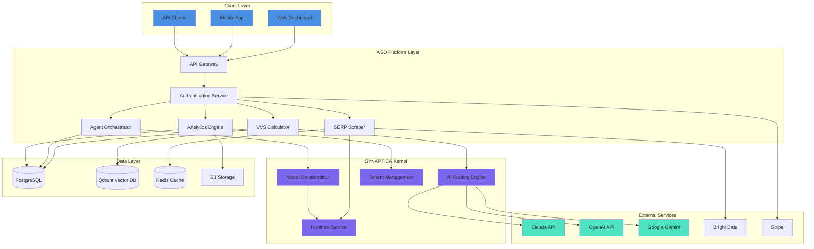
```mermaid
graph TB
    subgraph "Client Layer"
        A[Web Dashboard]
        B[Mobile App]
        C[API Clients]
    end
    
    subgraph "ASO Platform Layer"
        D[API Gateway]
        E[Authentication Service]
        F[VVS Calculator]
        G[Agent Orchestrator]
        H[SERP Scraper]
        I[Analytics Engine]
    end
    
    subgraph "SYNAPTICA Kernel"
        J[AI Routing Engine]
        K[Model Orchestration]
        L[Runtime Service]
        M[Tenant Management]
    end
    
    subgraph "Data Layer"
        N[(PostgreSQL)]
        O[(Qdrant Vector DB)]
        P[(Redis Cache)]
        Q[S3 Storage]
    end
    
    subgraph "External Services"
        R[Claude API]
        S[OpenAI API]
        T[Google Gemini]
        U[Bright Data]
        V[Stripe]
    end
    
    A --> D
    B --> D
    C --> D
    D --> E
    E --> F
    E --> G
    E --> H
    E --> I
    
    F --> J
    G --> K
    H --> L
    I --> M
    
    J --> R
    J --> S
    J --> T
    K --> L
    H --> U
    E --> V
    
    F --> N
    F --> O
    G --> N
    H --> P
    I --> N
    I --> Q
    
    style A fill:#4A90E2
    style B fill:#4A90E2
    style C fill:#4A90E2
    style J fill:#7B68EE
    style K fill:#7B68EE
    style L fill:#7B68EE
    style M fill:#7B68EE
    style R fill:#50E3C2
    style S fill:#50E3C2
    style T fill:#50E3C2
```

---

## 2. VVS Calculation Flow

### Sequence Diagram: VVS Calculation Process

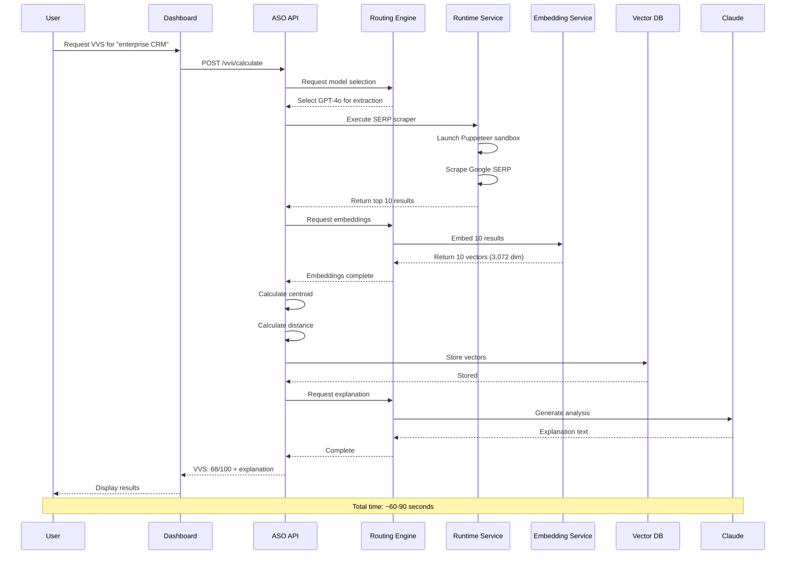
```mermaid
sequenceDiagram
    participant U as User
    participant D as Dashboard
    participant API as ASO API
    participant R as Routing Engine
    participant RT as Runtime Service
    participant E as Embedding Service
    participant V as Vector DB
    participant C as Claude
    
    U->>D: Request VVS for "enterprise CRM"
    D->>API: POST /vvs/calculate
    API->>R: Request model selection
    R-->>API: Select GPT-4o for extraction
    
    API->>RT: Execute SERP scraper
    RT->>RT: Launch Puppeteer sandbox
    RT->>RT: Scrape Google SERP
    RT-->>API: Return top 10 results
    
    API->>R: Request embeddings
    R->>E: Embed 10 results
    E-->>R: Return 10 vectors (3,072 dim)
    R-->>API: Embeddings complete
    
    API->>API: Calculate centroid
    API->>API: Calculate distance
    
    API->>V: Store vectors
    V-->>API: Stored
    
    API->>R: Request explanation
    R->>C: Generate analysis
    C-->>R: Explanation text
    R-->>API: Complete
    
    API-->>D: VVS: 68/100 + explanation
    D-->>U: Display results
    
    Note over U,C: Total time: ~60-90 seconds
```

---

## 3. Agent State Machine

### State Diagram: ASO Supervisor Agent

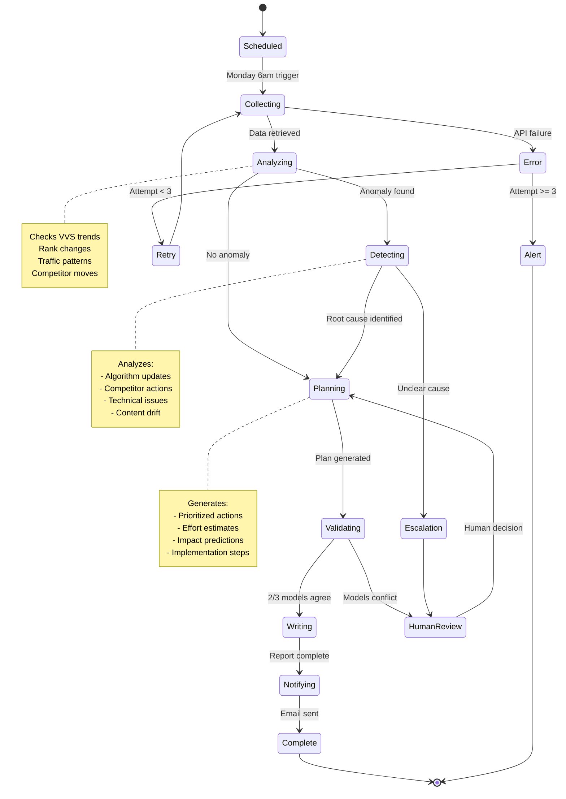
```mermaid
stateDiagram-v2
    [*] --> Scheduled
    
    Scheduled --> Collecting: Monday 6am trigger
    
    Collecting --> Analyzing: Data retrieved
    Collecting --> Error: API failure
    
    Analyzing --> Detecting: Anomaly found
    Analyzing --> Planning: No anomaly
    
    Detecting --> Planning: Root cause identified
    Detecting --> Escalation: Unclear cause
    
    Planning --> Validating: Plan generated
    
    Validating --> Writing: 2/3 models agree
    Validating --> HumanReview: Models conflict
    
    Writing --> Notifying: Report complete
    
    Notifying --> Complete: Email sent
    
    Complete --> [*]
    Error --> Retry: Attempt < 3
    Error --> Alert: Attempt >= 3
    Retry --> Collecting
    Alert --> [*]
    Escalation --> HumanReview
    HumanReview --> Planning: Human decision
    
    note right of Analyzing
        Checks VVS trends
        Rank changes
        Traffic patterns
        Competitor moves
    end note
    
    note right of Detecting
        Analyzes:
        - Algorithm updates
        - Competitor actions
        - Technical issues
        - Content drift
    end note
    
    note right of Planning
        Generates:
        - Prioritized actions
        - Effort estimates
        - Impact predictions
        - Implementation steps
    end note
```

---

## 4. Data Pipeline

### Flowchart: Data Acquisition & Processing

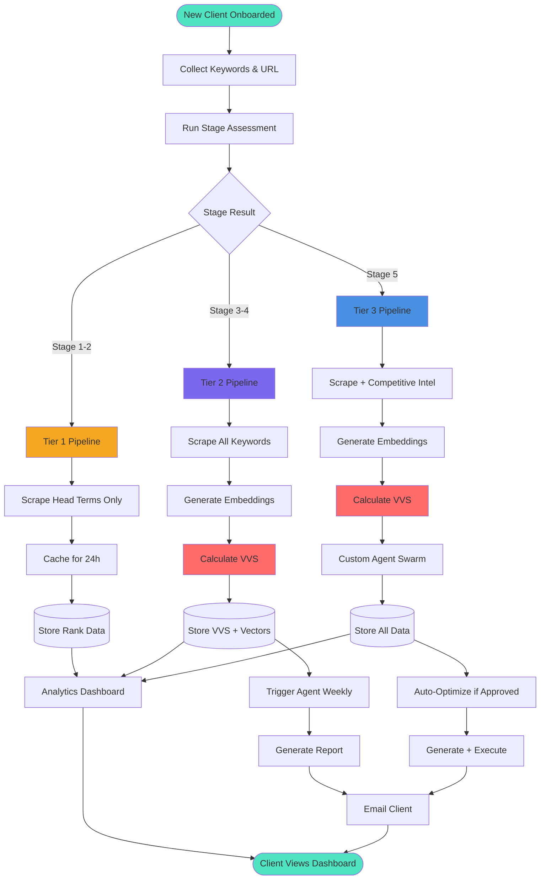
```mermaid
flowchart TD
    Start([New Client Onboarded]) --> Input[Collect Keywords & URL]
    
    Input --> Stage[Run Stage Assessment]
    Stage --> Stage1{Stage Result}
    
    Stage1 -->|Stage 1-2| Tier1[Tier 1 Pipeline]
    Stage1 -->|Stage 3-4| Tier2[Tier 2 Pipeline]
    Stage1 -->|Stage 5| Tier3[Tier 3 Pipeline]
    
    Tier1 --> Scrape1[Scrape Head Terms Only]
    Scrape1 --> Cache1[Cache for 24h]
    Cache1 --> Store1[(Store Rank Data)]
    
    Tier2 --> Scrape2[Scrape All Keywords]
    Scrape2 --> Embed2[Generate Embeddings]
    Embed2 --> VVS2[Calculate VVS]
    VVS2 --> Store2[(Store VVS + Vectors)]
    Store2 --> Agent2[Trigger Agent Weekly]
    
    Tier3 --> Scrape3[Scrape + Competitive Intel]
    Scrape3 --> Embed3[Generate Embeddings]
    Embed3 --> VVS3[Calculate VVS]
    VVS3 --> Custom3[Custom Agent Swarm]
    Custom3 --> Store3[(Store All Data)]
    Store3 --> Auto3[Auto-Optimize if Approved]
    
    Agent2 --> Report2[Generate Report]
    Auto3 --> Report3[Generate + Execute]
    
    Report2 --> Notify[Email Client]
    Report3 --> Notify
    
    Store1 --> Analytics[Analytics Dashboard]
    Store2 --> Analytics
    Store3 --> Analytics
    
    Analytics --> End([Client Views Dashboard])
    Notify --> End
    
    style Start fill:#50E3C2
    style End fill:#50E3C2
    style Tier1 fill:#F5A623
    style Tier2 fill:#7B68EE
    style Tier3 fill:#4A90E2
    style VVS2 fill:#FF6B6B
    style VVS3 fill:#FF6B6B
```

---

## 5. User Journey

### User Journey Map: From Signup to Value

```mermaid
journey
    title User Journey - First 30 Days
    section Day 1: Signup
      Visit landing page: 3: User
      Sign up (Google OAuth): 5: User
      Enter business details: 4: User
      Add 5 keywords: 4: User
      Connect Google Search Console: 3: User
      
    section Day 1: First Value
      Stage assessment runs: 5: System
      Receive "You are Stage 2/5": 4: User
      View initial recommendations: 5: User
      See first VVS scores: 5: User
      
    section Week 1: Engagement
      Daily rank updates: 4: User
      Read weekly intelligence report: 5: User
      Mark 2 tasks complete: 5: User
      See VVS improve +4 points: 5: User
      
    section Week 2: Adoption
      Invite team member: 4: User
      Export first CSV report: 4: User
      Agent detects competitor move: 5: System
      Implement agent recommendation: 5: User
      
    section Week 3: Expansion
      Add 15 more keywords: 5: User
      Explore competitive benchmarks: 5: User
      Consider Tier 2 upgrade: 4: User
      
    section Week 4: Conversion
      Upgrade to Tier 2: 5: User
      First agentic report: 5: User
      VVS tracking for all keywords: 5: User
      Share win with stakeholders: 5: User
```

---

## 6. Deployment Architecture

### Infrastructure Diagram: Production Environment

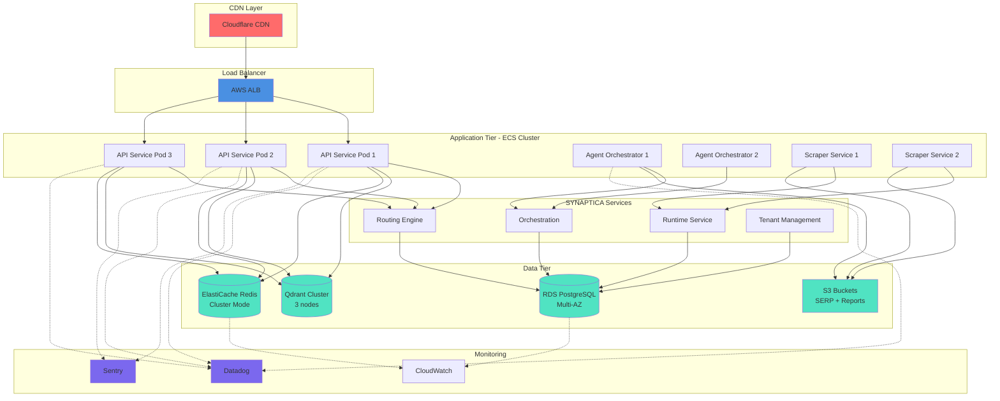
```mermaid
graph TB
    subgraph "CDN Layer"
        CF[Cloudflare CDN]
    end
    
    subgraph "Load Balancer"
        LB[AWS ALB]
    end
    
    subgraph "Application Tier - ECS Cluster"
        API1[API Service Pod 1]
        API2[API Service Pod 2]
        API3[API Service Pod 3]
        AGENT1[Agent Orchestrator 1]
        AGENT2[Agent Orchestrator 2]
        SCRAPE1[Scraper Service 1]
        SCRAPE2[Scraper Service 2]
    end
    
    subgraph "SYNAPTICA Services"
        ROUTE[Routing Engine]
        ORCH[Orchestration]
        RUNTIME[Runtime Service]
        TENANT[Tenant Management]
    end
    
    subgraph "Data Tier"
        RDS[(RDS PostgreSQL<br/>Multi-AZ)]
        QDRANT[(Qdrant Cluster<br/>3 nodes)]
        REDIS[(ElastiCache Redis<br/>Cluster Mode)]
        S3[S3 Buckets<br/>SERP + Reports]
    end
    
    subgraph "Monitoring"
        DD[Datadog]
        SENTRY[Sentry]
        CW[CloudWatch]
    end
    
    CF --> LB
    LB --> API1
    LB --> API2
    LB --> API3
    
    API1 --> ROUTE
    API2 --> ROUTE
    API3 --> ROUTE
    
    AGENT1 --> ORCH
    AGENT2 --> ORCH
    
    SCRAPE1 --> RUNTIME
    SCRAPE2 --> RUNTIME
    
    ROUTE --> RDS
    ORCH --> RDS
    RUNTIME --> RDS
    TENANT --> RDS
    
    API1 --> QDRANT
    API2 --> QDRANT
    API3 --> QDRANT
    
    API1 --> REDIS
    API2 --> REDIS
    API3 --> REDIS
    
    SCRAPE1 --> S3
    SCRAPE2 --> S3
    AGENT1 --> S3
    
    API1 -.-> DD
    API2 -.-> DD
    API3 -.-> DD
    AGENT1 -.-> DD
    
    API1 -.-> SENTRY
    API2 -.-> SENTRY
    
    RDS -.-> CW
    REDIS -.-> CW
    
    style CF fill:#FF6B6B
    style LB fill:#4A90E2
    style RDS fill:#50E3C2
    style QDRANT fill:#50E3C2
    style REDIS fill:#50E3C2
    style S3 fill:#50E3C2
    style DD fill:#7B68EE
    style SENTRY fill:#7B68EE
```

---

## 7. Database Schema

### Entity Relationship Diagram

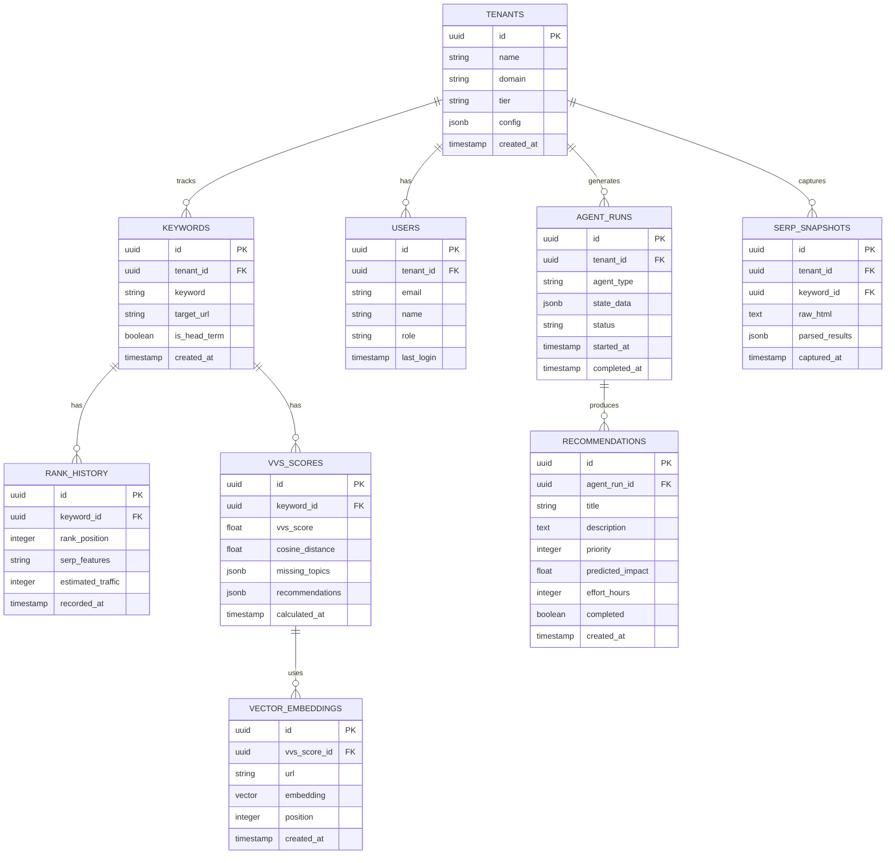
```mermaid
erDiagram
    TENANTS ||--o{ KEYWORDS : tracks
    TENANTS ||--o{ USERS : has
    TENANTS ||--o{ AGENT_RUNS : generates
    TENANTS {
        uuid id PK
        string name
        string domain
        string tier
        jsonb config
        timestamp created_at
    }
    
    KEYWORDS ||--o{ RANK_HISTORY : has
    KEYWORDS ||--o{ VVS_SCORES : has
    KEYWORDS {
        uuid id PK
        uuid tenant_id FK
        string keyword
        string target_url
        boolean is_head_term
        timestamp created_at
    }
    
    RANK_HISTORY {
        uuid id PK
        uuid keyword_id FK
        integer rank_position
        string serp_features
        integer estimated_traffic
        timestamp recorded_at
    }
    
    VVS_SCORES ||--o{ VECTOR_EMBEDDINGS : uses
    VVS_SCORES {
        uuid id PK
        uuid keyword_id FK
        float vvs_score
        float cosine_distance
        jsonb missing_topics
        jsonb recommendations
        timestamp calculated_at
    }
    
    VECTOR_EMBEDDINGS {
        uuid id PK
        uuid vvs_score_id FK
        string url
        vector embedding
        integer position
        timestamp created_at
    }
    
    AGENT_RUNS ||--o{ RECOMMENDATIONS : produces
    AGENT_RUNS {
        uuid id PK
        uuid tenant_id FK
        string agent_type
        jsonb state_data
        string status
        timestamp started_at
        timestamp completed_at
    }
    
    RECOMMENDATIONS {
        uuid id PK
        uuid agent_run_id FK
        string title
        text description
        integer priority
        float predicted_impact
        integer effort_hours
        boolean completed
        timestamp created_at
    }
    
    USERS {
        uuid id PK
        uuid tenant_id FK
        string email
        string name
        string role
        timestamp last_login
    }
    
    TENANTS ||--o{ SERP_SNAPSHOTS : captures
    SERP_SNAPSHOTS {
        uuid id PK
        uuid tenant_id FK
        uuid keyword_id FK
        text raw_html
        jsonb parsed_results
        timestamp captured_at
    }
```

---

## 8. Revenue Model

### Sankey Diagram: Revenue Flow by Tier

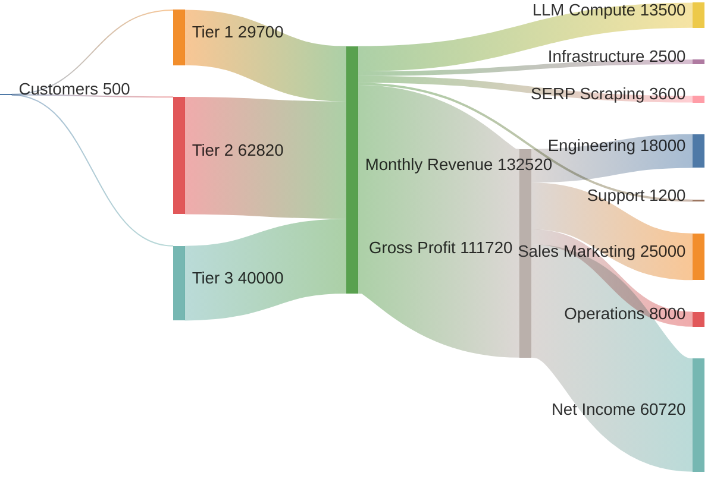
```mermaid
sankey-beta

%% Customer Distribution
Customers,Tier 1,300
Customers,Tier 2,180
Customers,Tier 3,20

%% Revenue Generation
Tier 1,Monthly Revenue,29700
Tier 2,Monthly Revenue,62820
Tier 3,Monthly Revenue,40000

%% Cost Allocation
Monthly Revenue,LLM Compute,13500
Monthly Revenue,Infrastructure,2500
Monthly Revenue,SERP Scraping,3600
Monthly Revenue,Support,1200
Monthly Revenue,Gross Profit,111720

%% Gross Profit Split
Gross Profit,Engineering,18000
Gross Profit,Sales Marketing,25000
Gross Profit,Operations,8000
Gross Profit,Net Income,60720
```

---

## 9. Implementation Timeline

### Gantt Chart: 20-Week Development Roadmap

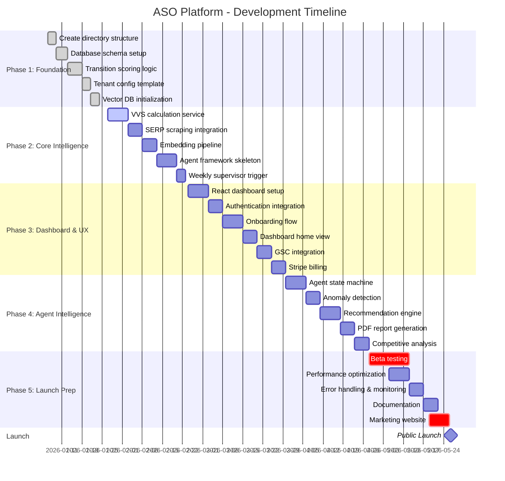
```mermaid
gantt
    title ASO Platform - Development Timeline
    dateFormat YYYY-MM-DD
    
    section Phase 1: Foundation
    Create directory structure       :done, p1-1, 2026-01-06, 3d
    Database schema setup             :done, p1-2, 2026-01-09, 4d
    Transition scoring logic          :done, p1-3, 2026-01-13, 5d
    Tenant config template            :done, p1-4, 2026-01-18, 3d
    Vector DB initialization          :done, p1-5, 2026-01-21, 3d
    
    section Phase 2: Core Intelligence
    VVS calculation service           :active, p2-1, 2026-01-27, 7d
    SERP scraping integration         :p2-2, 2026-02-03, 5d
    Embedding pipeline                :p2-3, 2026-02-08, 5d
    Agent framework skeleton          :p2-4, 2026-02-13, 7d
    Weekly supervisor trigger         :p2-5, 2026-02-20, 3d
    
    section Phase 3: Dashboard & UX
    React dashboard setup             :p3-1, 2026-02-24, 7d
    Authentication integration        :p3-2, 2026-03-03, 5d
    Onboarding flow                   :p3-3, 2026-03-08, 7d
    Dashboard home view               :p3-4, 2026-03-15, 5d
    GSC integration                   :p3-5, 2026-03-20, 5d
    Stripe billing                    :p3-6, 2026-03-25, 5d
    
    section Phase 4: Agent Intelligence
    Agent state machine               :p4-1, 2026-03-30, 7d
    Anomaly detection                 :p4-2, 2026-04-06, 5d
    Recommendation engine             :p4-3, 2026-04-11, 7d
    PDF report generation             :p4-4, 2026-04-18, 5d
    Competitive analysis              :p4-5, 2026-04-23, 5d
    
    section Phase 5: Launch Prep
    Beta testing                      :crit, p5-1, 2026-04-28, 14d
    Performance optimization          :p5-2, 2026-05-05, 7d
    Error handling & monitoring       :p5-3, 2026-05-12, 5d
    Documentation                     :p5-4, 2026-05-17, 5d
    Marketing website                 :crit, p5-5, 2026-05-19, 7d
    
    section Launch
    Public Launch                     :milestone, launch, 2026-05-26, 1d
```

---

## 10. AI Model Routing

### Decision Tree: Model Selection Logic

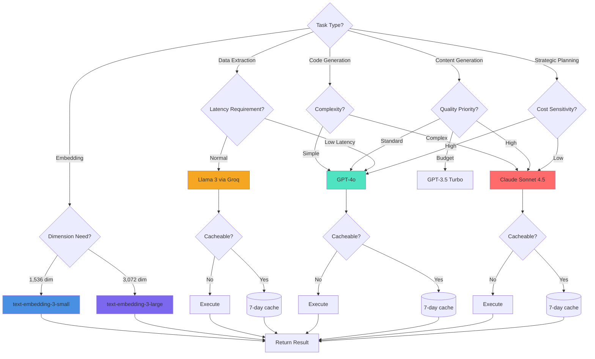
```mermaid
graph TD
    Start{Task Type?}
    
    Start -->|Strategic Planning| Strat{Cost Sensitivity?}
    Start -->|Data Extraction| Extract{Latency Requirement?}
    Start -->|Content Generation| Content{Quality Priority?}
    Start -->|Code Generation| Code{Complexity?}
    Start -->|Embedding| Embed{Dimension Need?}
    
    Strat -->|Low| Claude4[Claude Sonnet 4.5]
    Strat -->|High| GPT4o[GPT-4o]
    
    Extract -->|Low Latency| GPT4o
    Extract -->|Normal| Llama[Llama 3 via Groq]
    
    Content -->|High| Claude4
    Content -->|Standard| GPT4o
    Content -->|Budget| GPT35[GPT-3.5 Turbo]
    
    Code -->|Complex| Claude4
    Code -->|Simple| GPT4o
    
    Embed -->|3,072 dim| Large[text-embedding-3-large]
    Embed -->|1,536 dim| Small[text-embedding-3-small]
    
    Claude4 --> Cache1{Cacheable?}
    GPT4o --> Cache2{Cacheable?}
    Llama --> Cache3{Cacheable?}
    
    Cache1 -->|Yes| Store1[(7-day cache)]
    Cache1 -->|No| Execute1[Execute]
    
    Cache2 -->|Yes| Store2[(7-day cache)]
    Cache2 -->|No| Execute2[Execute]
    
    Cache3 -->|Yes| Store3[(7-day cache)]
    Cache3 -->|No| Execute3[Execute]
    
    Store1 --> Result[Return Result]
    Execute1 --> Result
    Store2 --> Result
    Execute2 --> Result
    Store3 --> Result
    Execute3 --> Result
    Large --> Result
    Small --> Result
    
    style Claude4 fill:#FF6B6B
    style GPT4o fill:#50E3C2
    style Llama fill:#F5A623
    style Large fill:#7B68EE
    style Small fill:#4A90E2
```

---

## 11. Feature Comparison

### Quadrant Chart: Competitive Positioning

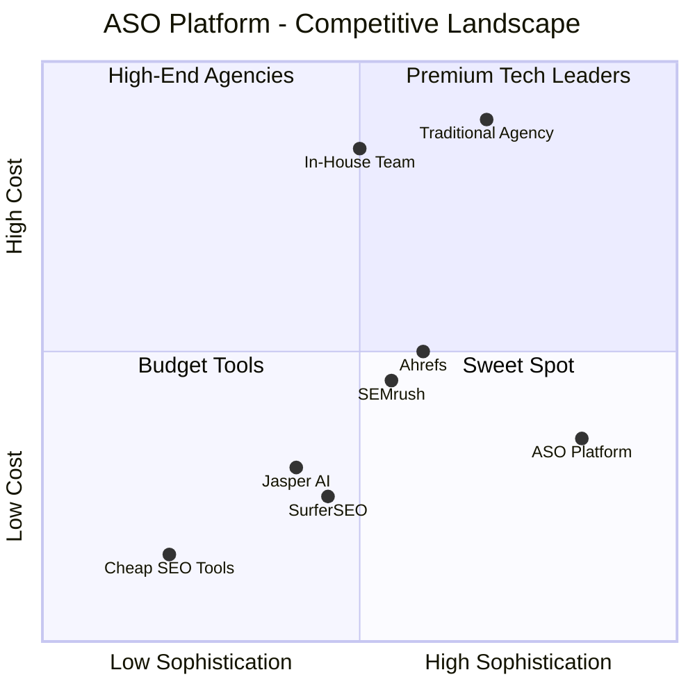
```mermaid
quadrantChart
    title ASO Platform - Competitive Landscape
    x-axis Low Sophistication --> High Sophistication
    y-axis Low Cost --> High Cost
    
    quadrant-1 "Premium Tech Leaders"
    quadrant-2 "High-End Agencies"
    quadrant-3 "Budget Tools"
    quadrant-4 "Sweet Spot"
    
    ASO Platform: [0.85, 0.35]
    SEMrush: [0.55, 0.45]
    Ahrefs: [0.60, 0.50]
    SurferSEO: [0.45, 0.25]
    Traditional Agency: [0.70, 0.90]
    Jasper AI: [0.40, 0.30]
    In-House Team: [0.50, 0.85]
    Cheap SEO Tools: [0.20, 0.15]
```

---

## 12. Customer Lifecycle

### Timeline: Customer Value Progression

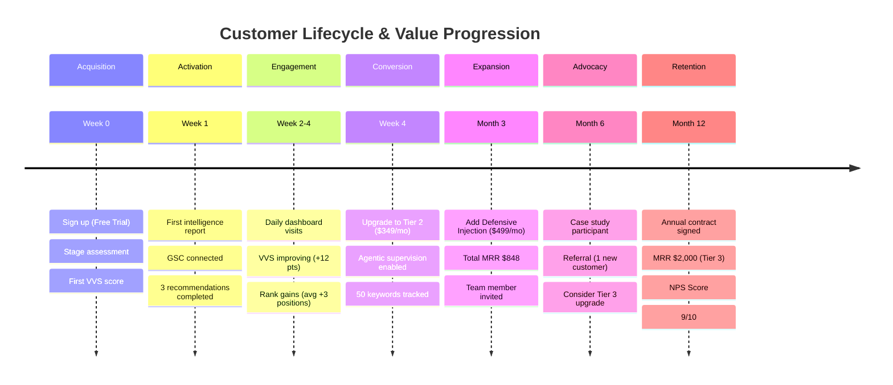
```mermaid
timeline
    title Customer Lifecycle & Value Progression
    
    section Acquisition
        Week 0 : Sign up (Free Trial)
               : Stage assessment
               : First VVS score
               
    section Activation  
        Week 1 : First intelligence report
               : GSC connected
               : 3 recommendations completed
               
    section Engagement
        Week 2-4 : Daily dashboard visits
                 : VVS improving (+12 pts)
                 : Rank gains (avg +3 positions)
                 
    section Conversion
        Week 4 : Upgrade to Tier 2 ($349/mo)
               : Agentic supervision enabled
               : 50 keywords tracked
               
    section Expansion
        Month 3 : Add Defensive Injection ($499/mo)
                : Total MRR $848
                : Team member invited
                
    section Advocacy
        Month 6 : Case study participant
                : Referral (1 new customer)
                : Consider Tier 3 upgrade
                
    section Retention
        Month 12 : Annual contract signed
                 : MRR $2,000 (Tier 3)
                 : NPS Score: 9/10
```

---

## 13. Agent Execution Flow

### Activity Diagram: Weekly Agent Run

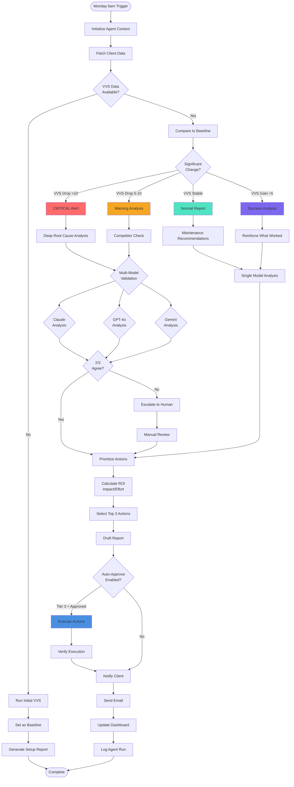
```mermaid
flowchart TB
    Start([Monday 6am Trigger]) --> Init[Initialize Agent Context]
    
    Init --> Fetch[Fetch Client Data]
    Fetch --> VVS{VVS Data<br/>Available?}
    
    VVS -->|No| FirstTime[Run Initial VVS]
    VVS -->|Yes| Compare[Compare to Baseline]
    
    FirstTime --> Baseline[Set as Baseline]
    Baseline --> Report1[Generate Setup Report]
    Report1 --> End
    
    Compare --> Delta{Significant<br/>Change?}
    
    Delta -->|VVS Drop >10| Critical[CRITICAL Alert]
    Delta -->|VVS Drop 5-10| Warning[Warning Analysis]
    Delta -->|VVS Stable| Normal[Normal Report]
    Delta -->|VVS Gain >5| Positive[Success Analysis]
    
    Critical --> RootCause[Deep Root Cause Analysis]
    Warning --> CompCheck[Competitor Check]
    Normal --> Maintain[Maintenance Recommendations]
    Positive --> Reinforce[Reinforce What Worked]
    
    RootCause --> Multi{Multi-Model<br/>Validation}
    CompCheck --> Multi
    Maintain --> Single[Single Model Analysis]
    Reinforce --> Single
    
    Multi --> Claude{Claude<br/>Analysis}
    Multi --> GPT{GPT-4o<br/>Analysis}
    Multi --> Gemini{Gemini<br/>Analysis}
    
    Claude --> Consensus{2/3<br/>Agree?}
    GPT --> Consensus
    Gemini --> Consensus
    
    Consensus -->|Yes| Priority[Prioritize Actions]
    Consensus -->|No| Human[Escalate to Human]
    
    Single --> Priority
    
    Priority --> ROI[Calculate ROI<br/>Impact/Effort]
    ROI --> Top3[Select Top 3 Actions]
    
    Top3 --> Draft[Draft Report]
    Draft --> Review{Auto-Approve<br/>Enabled?}
    
    Review -->|Tier 3 + Approved| Execute[Execute Actions]
    Review -->|No| Notify[Notify Client]
    
    Execute --> Verify[Verify Execution]
    Verify --> Notify
    
    Human --> ManualReview[Manual Review]
    ManualReview --> Priority
    
    Notify --> Email[Send Email]
    Email --> Dashboard[Update Dashboard]
    Dashboard --> Log[Log Agent Run]
    
    Log --> End([Complete])
    
    style Critical fill:#FF6B6B
    style Warning fill:#F5A623
    style Normal fill:#50E3C2
    style Positive fill:#7B68EE
    style Execute fill:#4A90E2
```

---

## 14. Multi-Model Validation

### Mind Map: Cross-Model Consensus Strategy

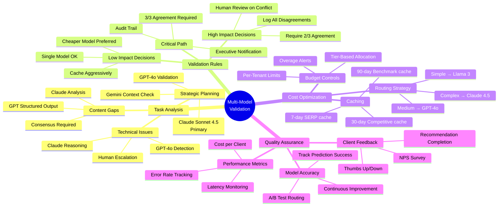
```mermaid
mindmap
  root((Multi-Model<br/>Validation))
    Task Analysis
      Strategic Planning
        Claude Sonnet 4.5<br/>Primary
        GPT-4o Validation
        Gemini Context Check
      Content Gaps
        Claude Analysis
        GPT Structured Output
        Consensus Required
      Technical Issues
        GPT-4o Detection
        Claude Reasoning
        Human Escalation
    Validation Rules
      High Impact Decisions
        Require 2/3 Agreement
        Human Review on Conflict
        Log All Disagreements
      Low Impact Decisions
        Single Model OK
        Cheaper Model Preferred
        Cache Aggressively
      Critical Path
        3/3 Agreement Required
        Executive Notification
        Audit Trail
    Cost Optimization
      Routing Strategy
        Simple → Llama 3
        Medium → GPT-4o
        Complex → Claude 4.5
      Caching
        7-day SERP cache
        30-day Competitive cache
        90-day Benchmark cache
      Budget Controls
        Per-Tenant Limits
        Tier-Based Allocation
        Overage Alerts
    Quality Assurance
      Model Accuracy
        Track Prediction Success
        A/B Test Routing
        Continuous Improvement
      Client Feedback
        Thumbs Up/Down
        Recommendation Completion
        NPS Survey
      Performance Metrics
        Latency Monitoring
        Error Rate Tracking
        Cost per Client
```

---

## 15. Cost Breakdown

### Pie Chart: Cost Structure (Tier 2 Client)

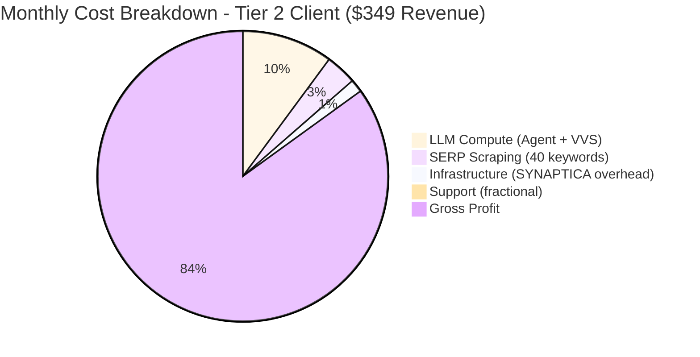
```mermaid
%%{init: {'theme':'base', 'themeVariables': { 'pieStrokeWidth': '2px'}}}%%
pie title Monthly Cost Breakdown - Tier 2 Client ($349 Revenue)
    "LLM Compute (Agent + VVS)" : 35
    "SERP Scraping (40 keywords)" : 12
    "Infrastructure (SYNAPTICA overhead)" : 5
    "Support (fractional)" : 3
    "Gross Profit" : 294
```

### Bar Chart: Margin Comparison

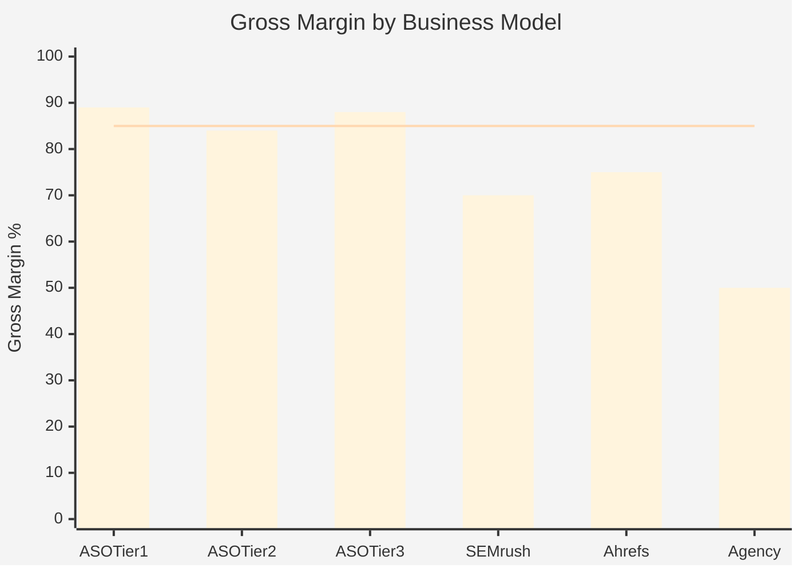
```mermaid
%%{init: {'theme':'base'}}%%
xychart-beta
    title "Gross Margin by Business Model"
    x-axis [ASO Tier 1, ASO Tier 2, ASO Tier 3, SEMrush, Ahrefs, Agency]
    y-axis "Gross Margin %" 0 --> 100
    bar [89, 84, 88, 70, 75, 50]
    line [85, 85, 85, 85, 85, 85]
```

---

## 16. Customer Acquisition Funnel

### Funnel Diagram: Conversion Flow

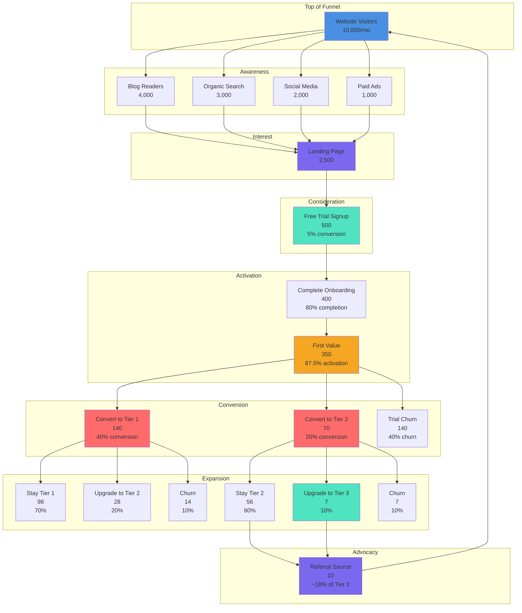
```mermaid
graph TD
    subgraph "Top of Funnel"
        V[Website Visitors<br/>10,000/mo]
    end
    
    subgraph "Awareness"
        V --> Blog[Blog Readers<br/>4,000]
        V --> Search[Organic Search<br/>3,000]
        V --> Social[Social Media<br/>2,000]
        V --> Ads[Paid Ads<br/>1,000]
    end
    
    subgraph "Interest"
        Blog --> LP[Landing Page<br/>2,500]
        Search --> LP
        Social --> LP
        Ads --> LP
    end
    
    subgraph "Consideration"
        LP --> Signup[Free Trial Signup<br/>500<br/>5% conversion]
    end
    
    subgraph "Activation"
        Signup --> Onboard[Complete Onboarding<br/>400<br/>80% completion]
        Onboard --> First[First Value<br/>350<br/>87.5% activation]
    end
    
    subgraph "Conversion"
        First --> Tier1[Convert to Tier 1<br/>140<br/>40% conversion]
        First --> Tier2[Convert to Tier 2<br/>70<br/>20% conversion]
        First --> Churn1[Trial Churn<br/>140<br/>40% churn]
    end
    
    subgraph "Expansion"
        Tier1 --> Stay1[Stay Tier 1<br/>98<br/>70%]
        Tier1 --> Up12[Upgrade to Tier 2<br/>28<br/>20%]
        Tier1 --> Churn2[Churn<br/>14<br/>10%]
        
        Tier2 --> Stay2[Stay Tier 2<br/>56<br/>80%]
        Tier2 --> Up23[Upgrade to Tier 3<br/>7<br/>10%]
        Tier2 --> Churn3[Churn<br/>7<br/>10%]
    end
    
    subgraph "Advocacy"
        Stay2 --> Refer[Referral Source<br/>10<br/>~18% of Tier 2]
        Up23 --> Refer
        Refer --> V
    end
    
    style V fill:#4A90E2
    style LP fill:#7B68EE
    style Signup fill:#50E3C2
    style First fill:#F5A623
    style Tier1 fill:#FF6B6B
    style Tier2 fill:#FF6B6B
    style Up23 fill:#50E3C2
    style Refer fill:#7B68EE
```

---

## 17. Technology Stack

### Block Diagram: Complete Tech Stack

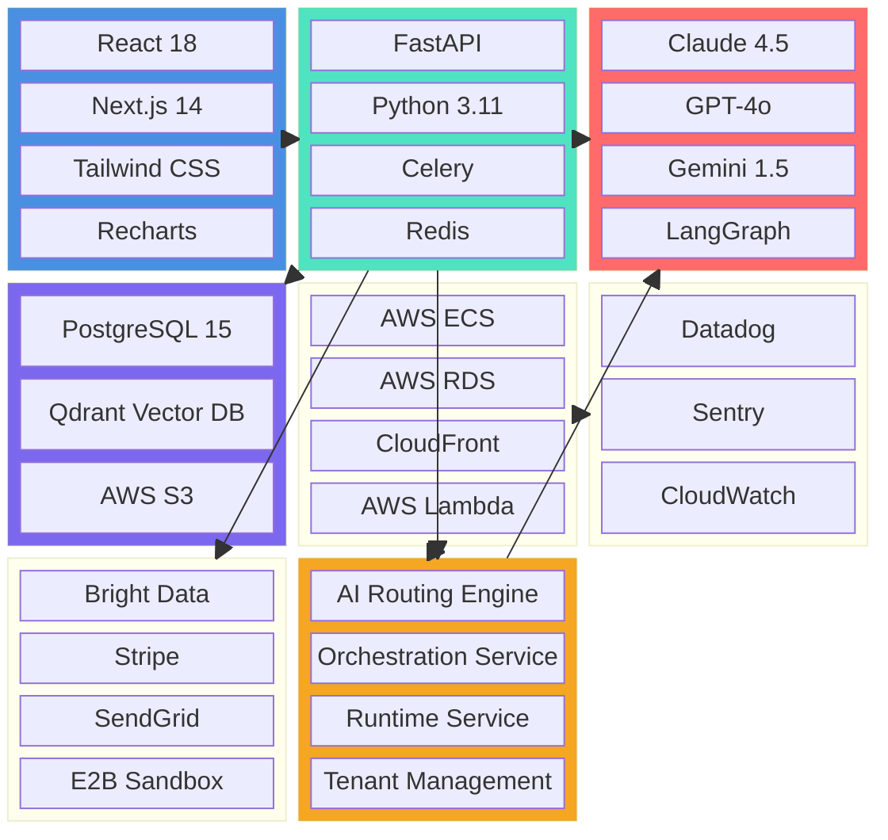
```mermaid
block-beta
    columns 3
    
    block:Frontend
        columns 1
        React["React 18"]
        Next["Next.js 14"]
        Tailwind["Tailwind CSS"]
        Recharts["Recharts"]
    end
    
    block:Backend
        columns 1
        FastAPI["FastAPI"]
        Python["Python 3.11"]
        Celery["Celery"]
        Redis["Redis"]
    end
    
    block:AI
        columns 1
        Claude["Claude 4.5"]
        OpenAI["GPT-4o"]
        Gemini["Gemini 1.5"]
        LangGraph["LangGraph"]
    end
    
    block:Database
        columns 1
        Postgres["PostgreSQL 15"]
        Qdrant["Qdrant Vector DB"]
        S3["AWS S3"]
    end
    
    block:Infrastructure
        columns 1
        ECS["AWS ECS"]
        RDS["AWS RDS"]
        CloudFront["CloudFront"]
        Lambda["AWS Lambda"]
    end
    
    block:Monitoring
        columns 1
        Datadog["Datadog"]
        Sentry["Sentry"]
        CloudWatch["CloudWatch"]
    end
    
    block:External
        columns 1
        Bright["Bright Data"]
        Stripe["Stripe"]
        SendGrid["SendGrid"]
        E2B["E2B Sandbox"]
    end
    
    block:SYNAPTICA
        columns 1
        Routing["AI Routing Engine"]
        Orchestration["Orchestration Service"]
        Runtime["Runtime Service"]
        Tenant["Tenant Management"]
    end
    
    Frontend --> Backend
    Backend --> AI
    Backend --> Database
    Backend --> SYNAPTICA
    SYNAPTICA --> AI
    SYNAPTICA --> Infrastructure
    Backend --> External
    Infrastructure --> Monitoring
    
    style Frontend fill:#4A90E2
    style Backend fill:#50E3C2
    style AI fill:#FF6B6B
    style Database fill:#7B68EE
    style SYNAPTICA fill:#F5A623
```

---

## 18. Growth Metrics Dashboard

### Git Graph: Feature Release Timeline

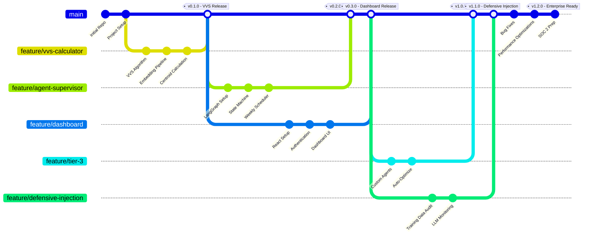
```mermaid
gitGraph
    commit id: "Initial Repo"
    commit id: "Project Setup"
    
    branch feature/vvs-calculator
    checkout feature/vvs-calculator
    commit id: "VVS Algorithm"
    commit id: "Embedding Pipeline"
    commit id: "Centroid Calculation"
    
    checkout main
    merge feature/vvs-calculator tag: "v0.1.0 - VVS Release"
    
    branch feature/agent-supervisor
    checkout feature/agent-supervisor
    commit id: "LangGraph Setup"
    commit id: "State Machine"
    commit id: "Weekly Scheduler"
    
    checkout main
    branch feature/dashboard
    checkout feature/dashboard
    commit id: "React Setup"
    commit id: "Authentication"
    commit id: "Dashboard UI"
    
    checkout main
    merge feature/agent-supervisor tag: "v0.2.0 - Agent Release"
    merge feature/dashboard tag: "v0.3.0 - Dashboard Release"
    
    branch feature/tier-3
    checkout feature/tier-3
    commit id: "Custom Agents"
    commit id: "Auto-Optimize"
    
    checkout main
    branch feature/defensive-injection
    checkout feature/defensive-injection
    commit id: "Training Data Audit"
    commit id: "LLM Monitoring"
    
    checkout main
    merge feature/tier-3 tag: "v1.0.0 - Full Launch"
    merge feature/defensive-injection tag: "v1.1.0 - Defensive Injection"
    
    commit id: "Bug Fixes"
    commit id: "Performance Optimizations"
    commit id: "SOC 2 Prep" tag: "v1.2.0 - Enterprise Ready"
```

---

## 19. Security Architecture

### Diagram: Security Layers

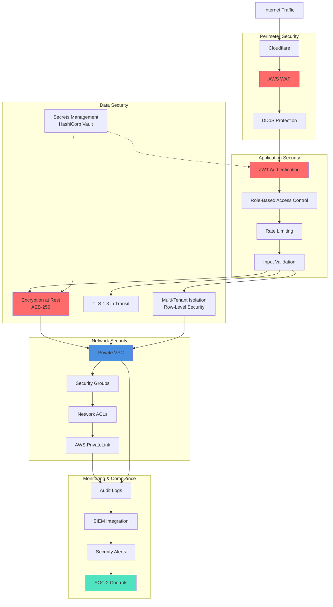
```mermaid
graph TB
    subgraph "Perimeter Security"
        WAF[AWS WAF]
        DDoS[DDoS Protection]
        CF[Cloudflare]
    end
    
    subgraph "Application Security"
        Auth[JWT Authentication]
        RBAC[Role-Based Access Control]
        Rate[Rate Limiting]
        Input[Input Validation]
    end
    
    subgraph "Data Security"
        Encrypt[Encryption at Rest<br/>AES-256]
        TLS[TLS 1.3 in Transit]
        Isolation[Multi-Tenant Isolation<br/>Row-Level Security]
        Vault[Secrets Management<br/>HashiCorp Vault]
    end
    
    subgraph "Network Security"
        VPC[Private VPC]
        SG[Security Groups]
        NACL[Network ACLs]
        PrivateLink[AWS PrivateLink]
    end
    
    subgraph "Monitoring & Compliance"
        Audit[Audit Logs]
        SIEM[SIEM Integration]
        Alerts[Security Alerts]
        SOC2[SOC 2 Controls]
    end
    
    Internet[Internet Traffic] --> CF
    CF --> WAF
    WAF --> DDoS
    DDoS --> Auth
    
    Auth --> RBAC
    RBAC --> Rate
    Rate --> Input
    
    Input --> Encrypt
    Input --> TLS
    Input --> Isolation
    
    Encrypt --> VPC
    TLS --> VPC
    Isolation --> VPC
    
    VPC --> SG
    SG --> NACL
    NACL --> PrivateLink
    
    PrivateLink --> Audit
    VPC --> Audit
    Audit --> SIEM
    SIEM --> Alerts
    Alerts --> SOC2
    
    Vault -.-> Auth
    Vault -.-> Encrypt
    
    style WAF fill:#FF6B6B
    style Auth fill:#FF6B6B
    style Encrypt fill:#FF6B6B
    style VPC fill:#4A90E2
    style SOC2 fill:#50E3C2
```

---

## 20. Business Model Canvas

### Canvas: ASO Platform Business Model

```mermaid
graph TB
    subgraph "Key Partners"
        P1[SYNAPTICA/ThalamixLabs]
        P2[Anthropic Claude]
        P3[OpenAI]
        P4[Bright Data]
        P5[Stripe]
    end
    
    subgraph "Key Activities"
        A1[AI Model Orchestration]
        A2[VVS Algorithm Development]
        A3[Agent Supervision]
        A4[Product Development]
        A5[Customer Success]
    end
    
    subgraph "Value Propositions"
        V1[Vector Visibility Score™]
        V2[24/7 AI Supervision]
        V3[Multi-Model Validation]
        V4[Future-Proof Platform]
        V5[85%+ Gross Margins]
    end
    
    subgraph "Customer Relationships"
        R1[Self-Service Onboarding]
        R2[Automated Intelligence Reports]
        R3[Email Support]
        R4[Community Forum]
        R5[Success Manager Tier 3]
    end
    
    subgraph "Customer Segments"
        S1[SMB SaaS Companies]
        S2[Marketing Agencies]
        S3[E-commerce Brands]
        S4[Professional Services]
        S5[Enterprise Multi-Location]
    end
    
    subgraph "Key Resources"
        K1[SYNAPTICA Platform]
        K2[Proprietary VVS Algorithm]
        K3[Synthetic Benchmark Dataset]
        K4[Engineering Team]
        K5[Vector Database]
    end
    
    subgraph "Channels"
        C1[Direct Website]
        C2[Content Marketing]
        C3[ProductHunt]
        C4[Partnerships]
        C5[Referral Program]
    end
    
    subgraph "Cost Structure"
        CS1[LLM Compute: 40%]
        CS2[Infrastructure: 25%]
        CS3[SERP Scraping: 20%]
        CS4[Engineering: 15%]
    end
    
    subgraph "Revenue Streams"
        RS1[Tier 1: $99/mo]
        RS2[Tier 2: $349/mo]
        RS3[Tier 3: $1.5K-$5K/mo]
        RS4[Defensive Injection: $499/mo]
        RS5[White-Label: Custom]
    end
    
    P1 --> A1
    P2 --> A1
    P3 --> A1
    P4 --> A1
    P5 --> RS1
    
    A1 --> V1
    A2 --> V1
    A3 --> V2
    
    V1 --> S1
    V2 --> S2
    V3 --> S3
    V4 --> S4
    V5 --> S5
    
    K1 --> A1
    K2 --> A2
    K3 --> A2
    
    S1 --> R1
    S2 --> R2
    S3 --> R3
    
    R1 --> C1
    R2 --> C2
    R3 --> C3
    
    C1 --> RS1
    C2 --> RS2
    C3 --> RS3
    
    RS1 --> CS1
    RS2 --> CS1
    RS3 --> CS1
    
    style V1 fill:#FF6B6B
    style V2 fill:#FF6B6B
    style S1 fill:#50E3C2
    style RS2 fill:#7B68EE
    style CS1 fill:#F5A623
```

---

## Usage Instructions

### How to Use These Diagrams

1. **GitHub README**: Copy the mermaid code blocks directly into your README.md
2. **Documentation**: Embed in GitBook, Notion, or Confluence (all support Mermaid)
3. **Presentations**: Export as PNG/SVG using [Mermaid Live Editor](https://mermaid.live/)
4. **Technical Specs**: Include in PRDs, architecture docs, and design reviews

### Rendering Tools

- **GitHub**: Native support (just paste the code block)
- **VS Code**: Install "Markdown Preview Mermaid Support" extension
- **Obsidian**: Built-in Mermaid support
- **Mermaid CLI**: `npm install -g @mermaid-js/mermaid-cli` then `mmdc -i diagram.md -o diagram.png`

### Color Scheme Reference

```
Primary Blue:   #4A90E2
Success Green:  #50E3C2
Warning Orange: #F5A623
Error Red:      #FF6B6B
Purple:         #7B68EE
```

---

## License

Copyright © 2025 ClearForge Technologies. All rights reserved.

These diagrams are proprietary and confidential. Unauthorized use, copying, or distribution is prohibited.
