# The ASO Revolution: Redefining Search for the AI Era
*A Vision Paper by Thalamus AI*

---

## 🎯 Our Fundamental Belief

At **Thalamus AI**, we believe that enterprise-grade technology capabilities should be accessible to everyone - not locked behind corporate budgets and complex implementations that only Fortune 500 companies can afford.

The most powerful tools and methodologies shouldn't be exclusive to those who can pay enterprise premiums. They should be available to every business owner, creator, and organization that wants to amplify their expertise and serve their community better.

**This belief drives everything we do. And it led us to discover something that's about to change how the entire world thinks about search optimization.**

---

## 💔 The Industry We Found: Broken, Predatory, and Failing Everyone

### The Predatory Problem

The SEO industry has become a parasitic ecosystem built on information asymmetry and fear. Agencies promise results they can't deliver, using methodologies they don't understand, charging for work that often makes things worse.

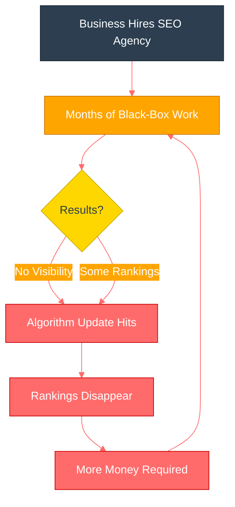

#### The typical SEO experience:
- ⏱️ Months of "optimization" with no clear results
- 🔒 Black-box methodologies you're told to "trust"
- 📉 Rankings that disappear with the next algorithm update
- 💸 Thousands of dollars spent on tactics that worked five years ago

**Why this happens:** Most SEO practitioners are still fighting the last war, using strategies designed for search engines that no longer exist.

---

### The Platform Disconnect

Meanwhile, Google, Bing, and other search platforms have fundamentally changed how they work:

**The result:** A massive disconnect between what search engines actually want and what the SEO industry is still selling.

---

### The Waste

**The human cost:** Business owners who could be serving their communities better are instead wasting time and resources on ineffective marketing that leaves them frustrated and skeptical of all digital marketing.

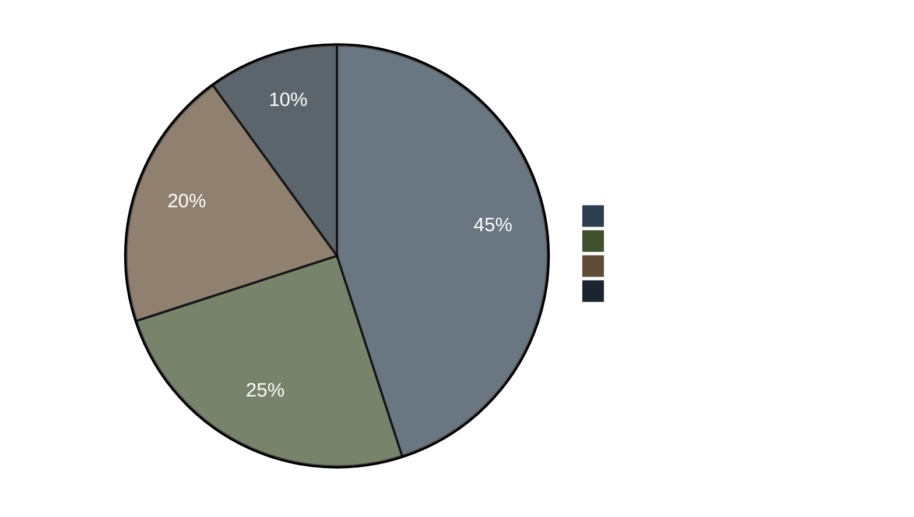

---

## 🔬 Our Systematic Deconstruction

Instead of accepting this broken system, we did something different. **We completely dismantled search optimization into its component parts and rebuilt it from first principles.**

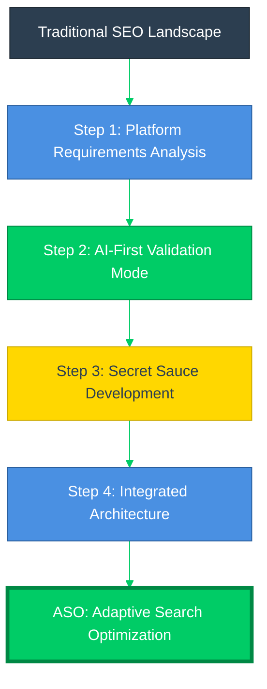

---

### Step 1: Platform Requirements Analysis

We studied exactly what each major search platform actually wants:

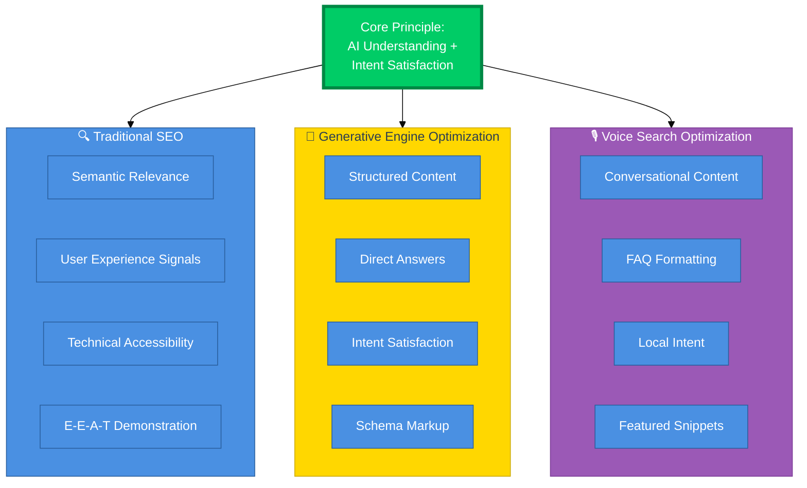

**Traditional SEO (Text-based search):**
- ✅ Semantic relevance and topical authority
- ✅ User experience signals and engagement metrics
- ✅ Technical accessibility and performance
- ✅ Authentic expertise demonstration (E-E-A-T)

**GEO (Generative Engine Optimization - AI Overviews):**
- ✅ Structured, easily parseable content
- ✅ Direct, authoritative answers to specific questions
- ✅ Content that satisfies user intent completely
- ✅ Proper schema markup and semantic structuring

**VSO (Voice Search Optimization):**
- ✅ Conversational content that mirrors natural speech patterns
- ✅ FAQ-style question-and-answer formatting
- ✅ Local intent optimization
- ✅ Featured snippet optimization for voice assistant responses

---

### Step 2: AI-First Validation Mode

We discovered that all three platforms are moving toward the same core principle: **AI systems that understand user intent and reward content that genuinely satisfies that intent.**

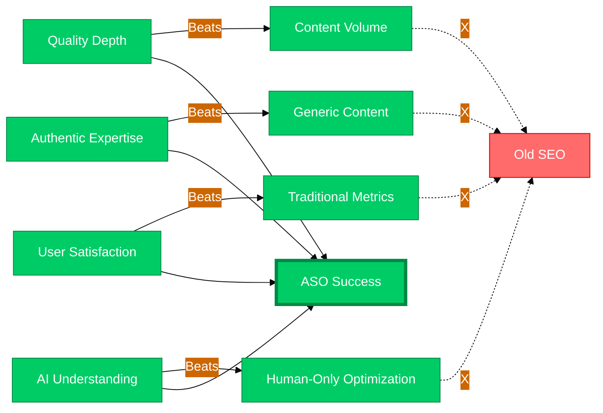

#### What we learned:

- 📚 **Quality depth beats content volume**
- 🎓 **Authentic expertise signals are becoming primary ranking factors**
- 📊 **User satisfaction metrics are more important than traditional SEO metrics**
- 🤖 **Content structure for AI understanding is fundamentally different from content structure for human reading**

**The validation:** When you optimize for AI understanding while maintaining human value, both search engines and users respond positively. The systems are designed to reward genuine value creation.

---

### Step 3: Secret Sauce Development

We identified specific opportunities where we could push the envelope - areas where we could anticipate platform evolution and build competitive advantages that others couldn't easily replicate.

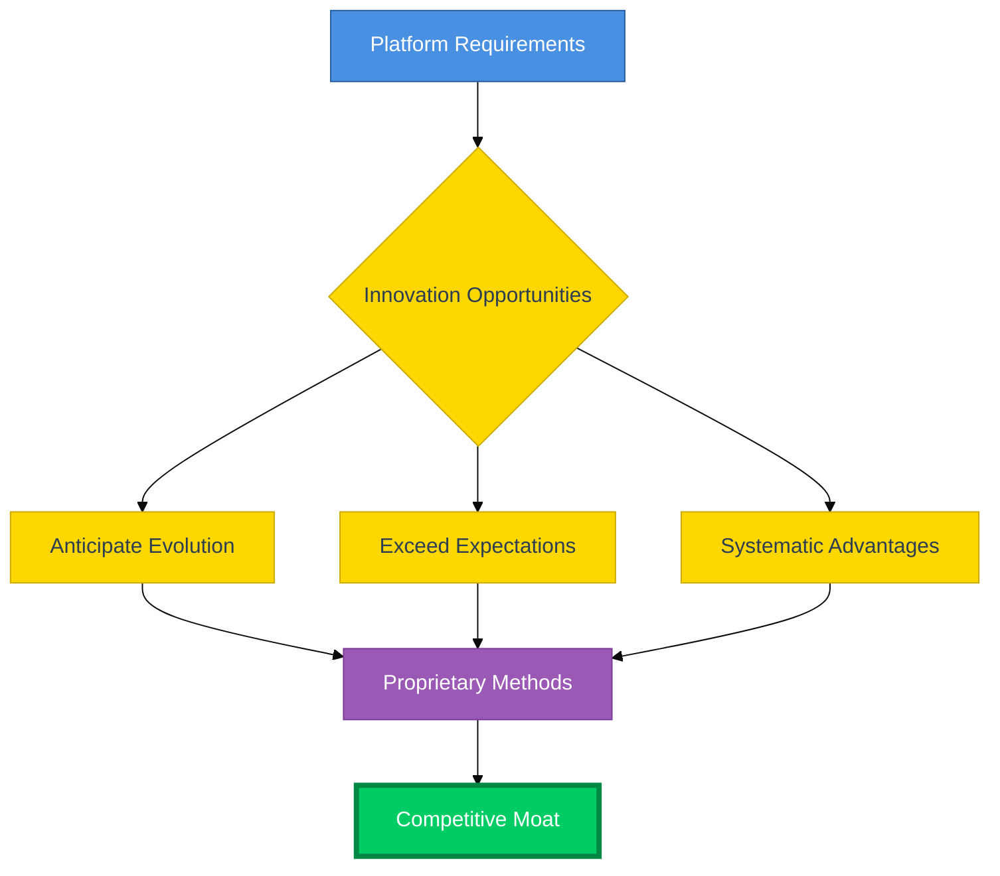

*[This section intentionally vague - our methodology innovations remain proprietary]*

**The key insight:** Instead of trying to game the system, we found ways to exceed what the system is designed to reward. We don't fight against platform requirements - we exceed them systematically.

---

### Step 4: Integrated Architecture

Rather than treating SEO, GEO, and VSO as separate disciplines, we created a unified system:

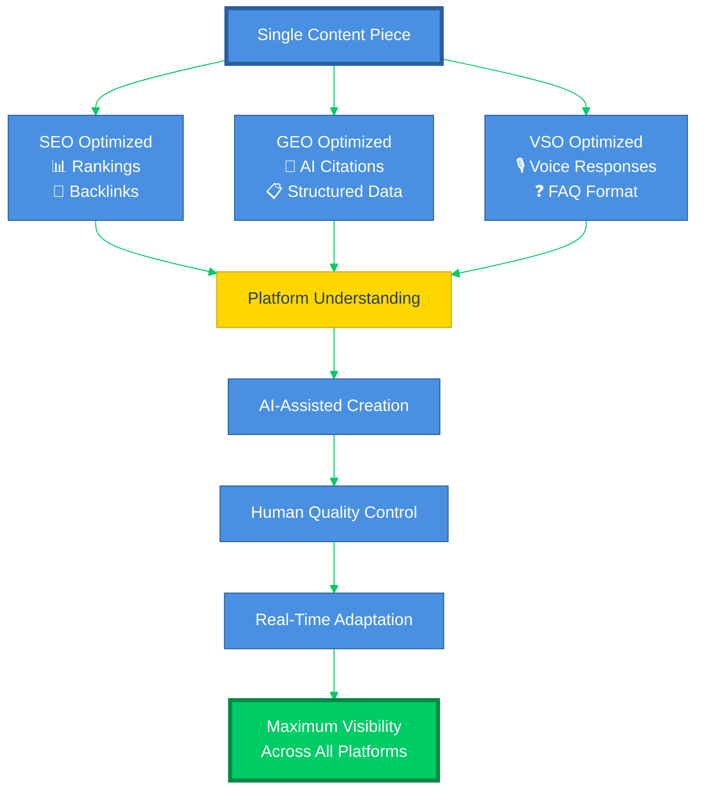

**The integrated system where:**

- ✅ Content serves all three optimization types simultaneously
- ✅ Each piece of content is structured for maximum platform understanding
- ✅ Human expertise is amplified through AI assistance, not replaced by it
- ✅ Real-time adaptation responds to platform changes automatically
- ✅ Quality controls ensure authenticity at scale

**The result:** A methodology that works WITH platform evolution instead of against it.

---

## 📊 Data-Driven Decision Making

Every element of our approach is validated through systematic testing and measurement:

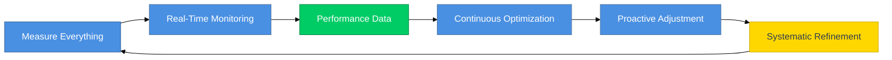

### What we measure:
- 📈 Platform visibility across all search modalities
- 👥 User engagement and satisfaction signals
- 💰 Business outcome attribution (leads, sales, growth)
- 🎯 Content performance and optimization opportunities
- 🏆 Competitive positioning and market authority

### How we adapt:
- ⚡ Real-time monitoring of platform changes and algorithm updates
- 🔄 Continuous optimization based on performance data
- 🔮 Proactive adjustment to emerging search technologies
- 🎯 Systematic refinement of content and technical approaches

**The difference:** Instead of guessing what works, we know what works because we measure everything and adapt continuously.

---

## 🚀 Welcome to ASO: Adaptive Search Optimization

We call our unified approach **ASO - Adaptive Search Optimization**.

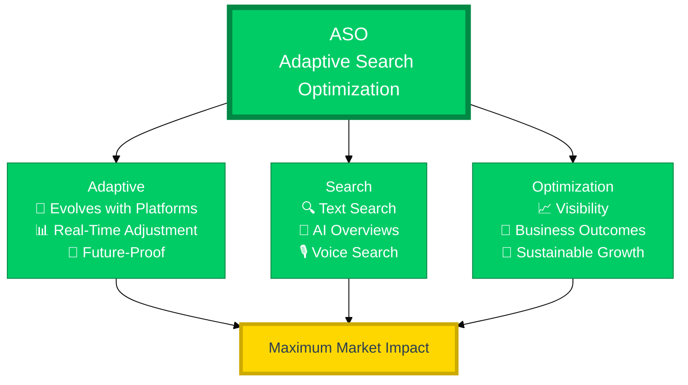

---

### What ASO Represents

**🔄 Adaptive:** Systems that evolve automatically with platform changes, user behavior shifts, and technology advancement.

**🔍 Search:** Comprehensive optimization across all search modalities - text, voice, AI overviews, and whatever comes next.

**📈 Optimization:** Not just ranking improvement, but complete optimization for user value, business outcomes, and sustainable growth.

---

### How ASO Works

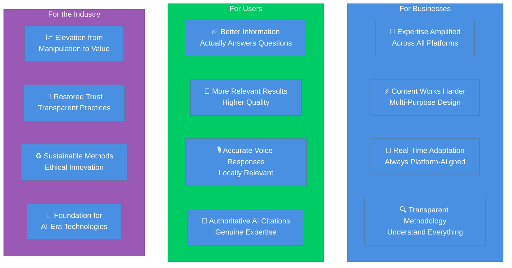

---

### The ASO Advantage

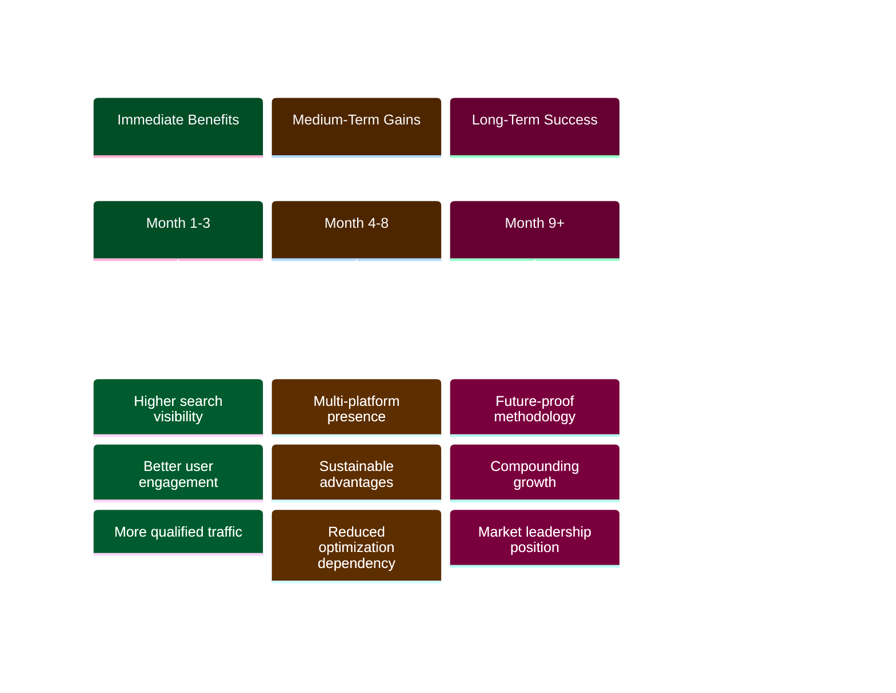

**⚡ Immediate Benefits:**
- 📈 Higher search visibility across all platforms
- 👥 Better user engagement and satisfaction
- 🎯 More qualified traffic and higher conversion rates
- 🛡️ Reduced dependence on any single search platform or algorithm

**🌱 Long-term Advantages:**
- 🔮 Future-proof methodology that adapts to platform evolution
- 🏆 Sustainable competitive advantages based on authentic expertise
- ♻️ Systematic improvement rather than constant re-optimization
- 📊 Business growth that compounds rather than depending on ongoing optimization spend

**🎯 Strategic Positioning:**
- 👑 Leadership position in next-generation search optimization
- 🏰 Competitive moats built on superior methodology rather than information hoarding
- 💎 Market differentiation based on results and transparency
- 🚀 Foundation for scaling across multiple businesses and industries

---

## 🌍 The Future We're Building

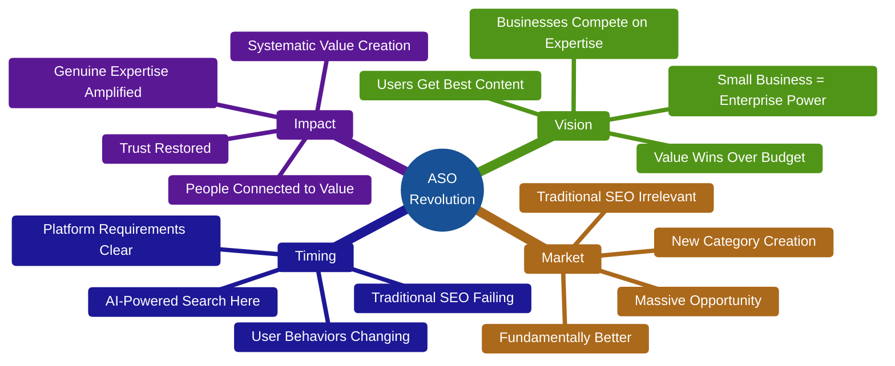

---

### Our Vision

A world where search optimization serves users, businesses, and platforms simultaneously. Where the best content wins because it provides the most value. Where small businesses can compete with enterprises on the strength of their expertise rather than the size of their marketing budgets.

---

### The Market We're Creating

ASO isn't just a better way to do SEO - it's the foundation of an entirely new market category. We're not competing with SEO agencies anymore. **We're making traditional SEO irrelevant by building something fundamentally better.**

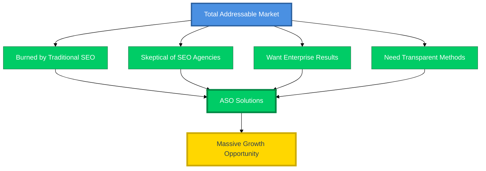

**The opportunity:** Every business that has ever been burned by traditional SEO, every organization that knows they should be doing search marketing but doesn't trust the existing options, every entrepreneur who wants enterprise-grade results without enterprise-level complexity.

---

### Why Now

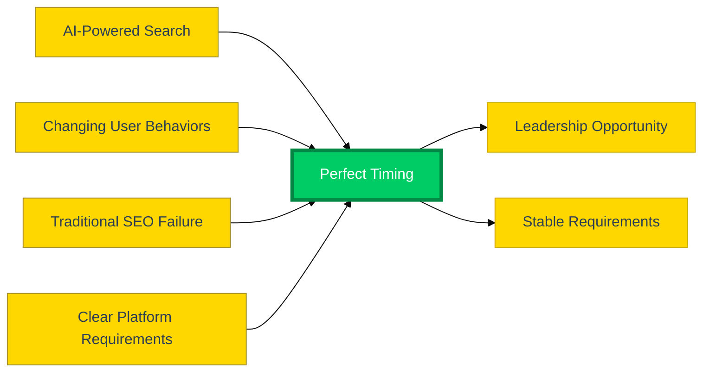

The convergence of AI-powered search, changing user behaviors, and the failure of traditional SEO methods creates a perfect opportunity for systematic innovation. The old approaches are failing visibly while the new requirements are becoming clear.

**The timing:** Early enough to establish leadership, late enough that the platform requirements are stable and measurable.

---

### What This Means

For the first time in decades, search optimization can become what it should have been all along: **a systematic approach to amplifying genuine expertise and connecting people with the information and services that actually help them.**

---

## ⚡ The ASO Revolution Begins Now

Traditional SEO promised you could game the system. ASO delivers something better: systems that make gaming unnecessary because they're designed to reward exactly what you should be doing anyway - **creating genuine value for the people you serve.**

---

### The Choice is Simple

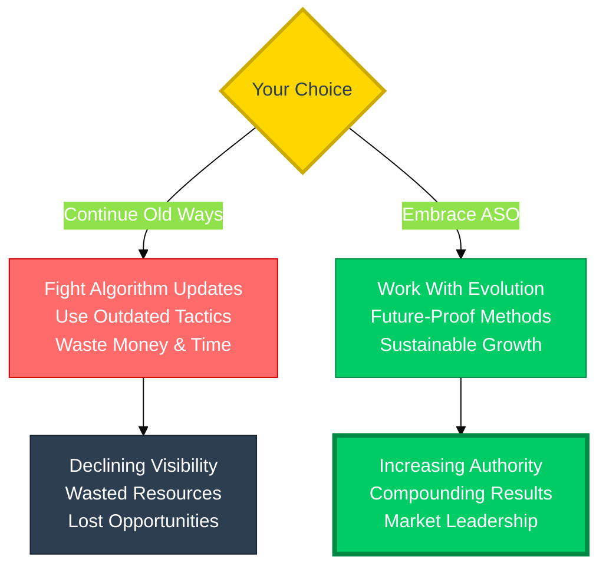

**❌ Continue fighting algorithm updates with outdated tactics**

**✅ Or embrace ASO and work WITH the evolution of search**

---

## 🎆 Welcome to the Revolution

**The revolution isn't coming. It's here.**

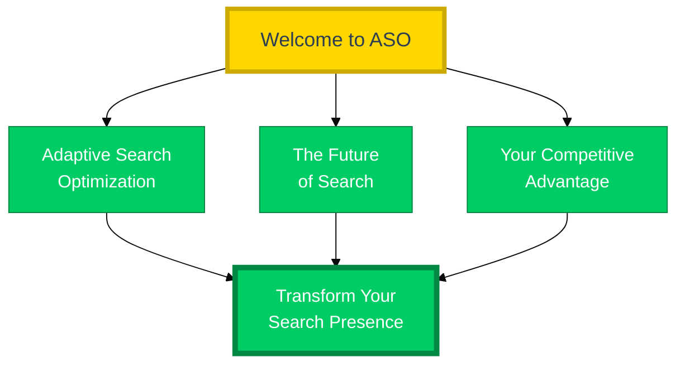

### Welcome to Adaptive Search Optimization
### Welcome to the future of search  
### Welcome to ASO

---

**🚀 Thalamus AI**

*Making enterprise-grade technology accessible to everyone*

**[Thalamus.ai](https://Thalamus.ai) | [email protected]**

---

**©2025 Thalamus AI. All rights reserved.**

*ASO™ (Adaptive Search Optimization), and all associated methodologies are proprietary technologies of Thalamus AI.*

