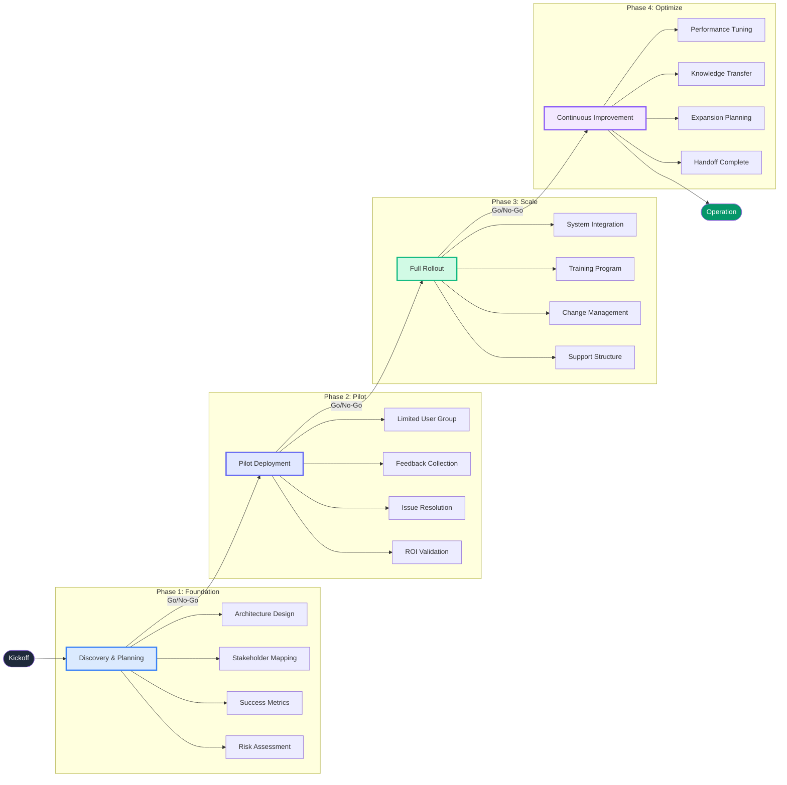
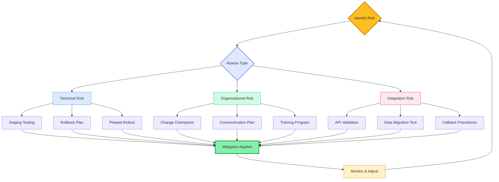
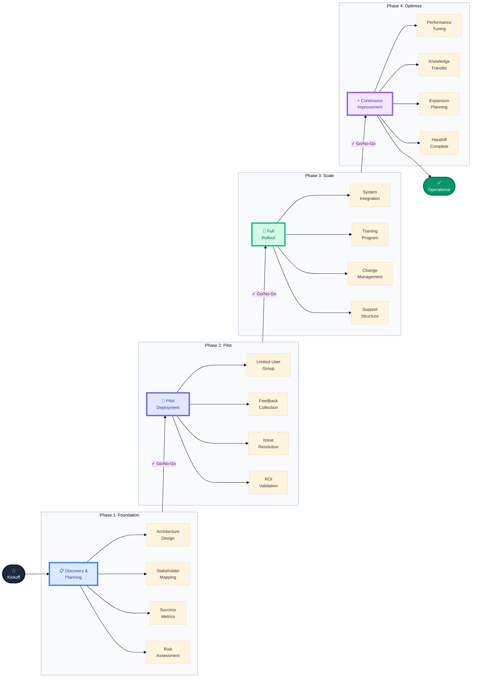
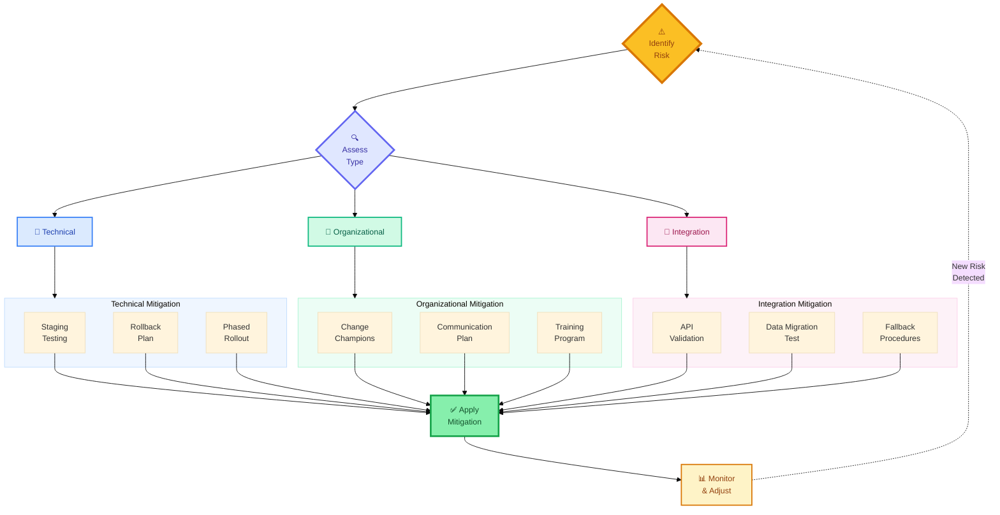

# Implementation Planning & Strategy Page Enhancement Plan

## Executive Summary

This document provides a detailed implementation plan for enhancing the `/solutions/consulting/implementation-planning-and-strategy` page with 10 major improvements. The plan includes complete content, component architecture, styling specifications, and implementation order.

---

## 1. Section-by-Section Enhancement Plan

### Item 1: Enhance "In Plain English" Section

**Purpose:** Make the concept of implementation planning more accessible and relatable

**Goal:** Help visitors understand both the technical and organizational dimensions of implementation planning

**Current State:** Basic single-paragraph explanation with house blueprint analogy

**Content to Add:**

```typescript
const plainEnglishEnhancements = {
  additionalAnalogies: [
    {
      title: "The Mountain Climbing Expedition",
      content: "Implementation planning is like preparing for a challenging mountain climb. You don't just show up at the base and start climbing—you study the route, prepare equipment, train your team, establish checkpoints, and have rescue plans ready. The summit (successful deployment) is only reachable through careful preparation at each stage.",
    },
    {
      title: "The Restaurant Kitchen Build-Out",
      content: "Opening a restaurant requires more than a great menu. You need to install commercial equipment, train the kitchen staff on new appliances, coordinate with suppliers, and do soft openings before the grand launch. Skip any step, and your opening night becomes a disaster.",
    }
  ],
  technicalVsOrganizational: {
    title: "Two Tracks, One Destination",
    description: "Successful AI implementation runs on parallel tracks—technical deployment and organizational change. Ignore either, and your project fails.",
    technicalTrack: {
      label: "Technical Track",
      items: [
        "System installation and configuration",
        "Data migration and integration",
        "Security setup and testing",
        "Performance optimization"
      ]
    },
    organizationalTrack: {
      label: "Organizational Track", 
      items: [
        "Stakeholder communication",
        "User training and support",
        "Workflow redesign",
        "Adoption monitoring"
      ]
    }
  }
};
```

**Component Structure:**
- Use existing `FadeIn` wrapper
- Two-column grid for Technical vs Organizational comparison (md:grid-cols-2)
- Card-based layout for additional analogies
- Visual connector showing parallel tracks

**Styling Recommendations:**
- Technical Track: Blue gradient background (`bg-gradient-to-br from-blue-50 to-blue-100`)
- Organizational Track: Green gradient background (`bg-gradient-to-br from-green-50 to-green-100`)
- Use `Target` icon for technical, `Users` icon for organizational
- Border colors: `border-blue-200` and `border-green-200`

**Integration:** Insert immediately after current "In Plain English" paragraph, before Plain English Terms section

**Complexity:** Low

---

### Item 2: Expand "Plain English Terms" Section

**Purpose:** Demystify technical jargon that confuses business stakeholders

**Goal:** Build confidence by translating complex concepts into everyday language

**Content to Add:**

```typescript
const additionalPlainEnglishTerms = [
  {
    term: "Staging Environment",
    simple: "A safe practice space where we test AI tools with fake data before going live—like a dress rehearsal for a play where actors run through scenes without a real audience.",
    analogy: "Think of it like test-driving a car in an empty parking lot before taking it on the highway. You want to learn how everything works without risking a crash in traffic.",
    icon: "TestTube"
  },
  {
    term: "Production Deployment",
    simple: "The moment AI tools go live for real work—flipping the switch from practice mode to actual business operations where real data flows and real decisions get made.",
    analogy: "Like opening night of a Broadway show: the dress rehearsals are over, the audience is seated, and the performance counts. There's no 'pause and restart' button.",
    icon: "Rocket"
  },
  {
    term: "Rollback Plan",
    simple: "A predetermined escape route that lets us quickly return to the old system if something goes wrong—like having a parachute when you're testing a new airplane.",
    analogy: "Imagine renovating your kitchen but keeping your old refrigerator plugged in next door, just in case the new one breaks on Thanksgiving morning when you're cooking for 20 people.",
    icon: "Undo2"
  },
  {
    term: "User Acceptance Testing (UAT)",
    simple: "Real employees trying the AI tools with real tasks before full deployment—ensuring the solution actually works for the people who'll use it daily.",
    analogy: "Like having family members test a new recipe before serving it at a dinner party. They'll tell you honestly if it needs more salt or if the instructions are confusing.",
    icon: "ClipboardCheck"
  },
  {
    term: "Knowledge Transfer",
    simple: "The process of teaching your internal team to manage and extend the AI system independently—so you're not forever dependent on outside consultants.",
    analogy: "Think of it like teaching your teenager to drive rather than hiring a chauffeur. There's upfront investment in training, but then they can go anywhere on their own.",
    icon: "GraduationCap"
  }
];
```

**Component Structure:**
- Extend existing grid layout from 2 columns to 3 columns on large screens
- Keep same card structure with icon, term, simple explanation, and analogy box
- Add subtle color coding: Staging (blue), Production (green), Rollback (amber), UAT (purple), Knowledge Transfer (indigo)

**Styling Recommendations:**
- Use Lucide icons: `TestTube`, `Rocket`, `Undo2`, `ClipboardCheck`, `GraduationCap`
- Maintain existing card styling with colored borders
- Icons in rounded circles with matching background tints

**Integration:** Append to existing `plainEnglishTerms` array in page.tsx

**Complexity:** Low

---

### Item 3: Add Mermaid Diagrams

**Purpose:** Visualize complex processes that are hard to explain with text alone

**Goal:** Make abstract concepts concrete through visual flowcharts

#### Diagram 1: Parallel Implementation Tracks

```mermaid
graph TB
    subgraph "WEEK 1-2: Foundation"
        TECH1[System Architecture Design] --> ORG1[Change Readiness Assessment]
        ORG1 --> TECH1
    end
    
    subgraph "WEEK 3-4: Setup"
        TECH2[Environment Configuration] --> ORG2[Stakeholder Communication Plan]
        ORG2 --> TECH2
    end
    
    subgraph "WEEK 5-8: Pilot"
        TECH3[Pilot Deployment] --> ORG3[Champion Training]
        ORG3 --> TECH3
    end
    
    subgraph "WEEK 9-12: Scale"
        TECH4[Full Integration] --> ORG4[Organization-Wide Training]
        ORG4 --> TECH4
    end
    
    subgraph "WEEK 13+: Optimize"
        TECH5[Performance Tuning] --> ORG5[Feedback Loops & Support]
        ORG5 --> TECH5
    end
    
    style TECH1 fill:#3b82f6,color:#fff
    style TECH2 fill:#3b82f6,color:#fff
    style TECH3 fill:#3b82f6,color:#fff
    style TECH4 fill:#3b82f6,color:#fff
    style TECH5 fill:#3b82f6,color:#fff
    style ORG1 fill:#10b981,color:#fff
    style ORG2 fill:#10b981,color:#fff
    style ORG3 fill:#10b981,color:#fff
    style ORG4 fill:#10b981,color:#fff
    style ORG5 fill:#10b981,color:#fff
```



**Caption:** "Technical and organizational tracks run in parallel throughout implementation"

#### Diagram 2: 4-Phase Rollout



**Caption:** "Each phase has defined activities, milestones, and go/no-go decision points"

#### Diagram 3: Risk Mitigation Path



**Caption:** "Risk identification triggers specific mitigation strategies based on risk type"

**Component Structure:**
- Use existing `Mermaid` component from `@/components/ui/Mermaid`
- Wrap each diagram in `FadeIn` animation with staggered delays
- Add descriptive caption below each diagram

**Styling Recommendations:**
- Place diagrams in centered containers with max-width
- Use consistent color scheme: Blue (technical), Green (organizational), Purple (integration)
- Add subtle background cards behind diagrams

**Integration:** 
- Diagram 1: After "Technical vs Organizational" section (new section)
- Diagram 2: Enhance existing 4-phase section (replace simple diagram)
- Diagram 3: Insert after "Common Implementation Pitfalls" section (new)

**Complexity:** Medium

---

### Item 4: Add "Real Implementation Case Studies" Section

**Purpose:** Provide concrete, detailed examples of implementation success

**Goal:** Build credibility and show practical application of the framework

**Content to Write:**

```typescript
const implementationCaseStudies = [
  {
    id: "resistant-sales-team",
    title: "The Resistant Sales Team",
    industry: "B2B Software",
    companySize: "150 employees",
    timeline: "8 weeks",
    challenge: "Sales team rejected new AI CRM tool, fearing it would replace them or expose performance issues",
    solution: "Co-design approach with sales champions, transparent ROI demonstration, gradual feature introduction",
    activities: [
      "Week 1-2: Sales champion identification and executive alignment",
      "Week 3-4: Co-design sessions with 8 volunteer reps",
      "Week 5-6: Pilot with 20 users, daily feedback loops",
      "Week 7-8: Full rollout with peer training program"
    ],
    adoptionRate: {
      before: "20%",
      after: "95%",
      timeline: "60 days"
    },
    metrics: {
      productivity: "+40%",
      adminTime: "-70%",
      dealVelocity: "+25%",
      userSatisfaction: "4.6/5.0"
    },
    lessonsLearned: [
      "Involving end-users in design increased buy-in by 300%",
      "Showing time savings (not replacement) changed the narrative",
      "Peer trainers were 4x more effective than external consultants"
    ],
    keyFinding: "Involving end-users in design increased adoption from 20% to 95% and boosted productivity 40%"
  },
  {
    id: "phased-manufacturing",
    title: "The Phased Manufacturing Rollout",
    industry: "Manufacturing",
    companySize: "2,400 employees across 50 facilities",
    timeline: "6 months",
    challenge: "Deploy AI predictive maintenance across 50 factories without disrupting production schedules",
    solution: "3-factory pilot, refinement based on real data, phased expansion with local champions",
    activities: [
      "Month 1: Pilot at 3 diverse facilities (high/medium/low complexity)",
      "Month 2: Model refinement based on equipment variations",
      "Month 3: Regional rollout (10 facilities)",
      "Month 4-5: National expansion (25 facilities)",
      "Month 6: Full deployment with optimization"
    ],
    adoptionRate: {
      before: "N/A (new system)",
      after: "87%",
      timeline: "6 months"
    },
    metrics: {
      downtimePrevented: "$2.1M",
      maintenanceCost: "-23%",
      equipmentUptime: "+12%",
      roi: "340%"
    },
    lessonsLearned: [
      "Pilot sites caught 14 integration issues before full rollout",
      "Local maintenance champions reduced training time by 60%",
      "Equipment variation required model customization per facility type"
    ],
    keyFinding: "Phased rollout caught $2M in potential downtime issues before they affected all 50 factories"
  },
  {
    id: "rapid-retail-deployment",
    title: "The Rapid Retail Deployment",
    industry: "Retail Chain",
    companySize: "800 employees across 45 stores",
    timeline: "3 weeks",
    challenge: "Deploy AI inventory management before peak holiday season with only 3 weeks until Black Friday",
    solution: "Rapid pilot at 5 stores, overnight cutover approach, 24/7 war room support during transition",
    activities: [
      "Week 1: Emergency pilot at 5 highest-volume stores",
      "Days 15-17: System hardening based on pilot feedback",
      "Days 18-20: Staff training blitz (2-hour sessions per store)",
      "Days 21: Coordinated cutover during closed hours",
      "Days 22-30: War room support and rapid issue resolution"
    ],
    adoptionRate: {
      before: "Manual spreadsheets",
      after: "92%",
      timeline: "3 weeks"
    },
    metrics: {
      stockouts: "-34%",
      inventoryAccuracy: "98.7%",
      laborHours: "-18%",
      salesLift: "+8%"
    },
    lessonsLearned: [
      "Aggressive timeline required executive air cover for disruptions",
      "Store managers became the critical success factor",
      "Real-time issue resolution team prevented rollout failure",
      "Post-holiday optimization was essential for long-term success"
    ],
    keyFinding: "Despite compressed timeline, rapid deployment with intensive support achieved 92% adoption and prevented holiday stockouts"
  },
  {
    id: "complex-healthcare",
    title: "The Complex Healthcare Integration",
    industry: "Healthcare Network",
    companySize: "3,200 employees across 12 facilities",
    timeline: "9 months",
    challenge: "Integrate AI diagnostic support tool with legacy EMR systems while maintaining HIPAA compliance and clinician trust",
    solution: "18-month plan compressed through parallel workstreams, extensive clinician involvement, security-first architecture",
    activities: [
      "Months 1-2: Security architecture and HIPAA compliance validation",
      "Months 2-4: EMR integration development and testing",
      "Months 3-5: Clinician champion program (2 per department)",
      "Months 5-6: Controlled pilot in 2 departments",
      "Months 7-8: Phased rollout by specialty",
      "Month 9: Full deployment with continuous monitoring"
    ],
    adoptionRate: {
      before: "0% (pilot)",
      after: "78%",
      timeline: "9 months"
    },
    metrics: {
      diagnosticAccuracy: "+15%",
      documentationTime: "-22%",
      physicianSatisfaction: "4.2/5.0",
      patientThroughput: "+11%"
    },
    lessonsLearned: [
      "Clinician trust required demonstrating AI as assistant, not replacement",
      "EMR integration complexity underestimated by 40%—added 6 weeks",
      "Specialty-specific workflows required customized training",
      "Security audit approval became the critical path item"
    ],
    keyFinding: "Healthcare integration required 40% more time than estimated, but clinician involvement and security-first approach achieved 78% adoption in complex environment"
  }
];
```

**Component Structure:**
- Create new `CaseStudyCard` component with tabs for Overview, Timeline, Metrics, Lessons
- Use horizontal tabs: Overview | Timeline | Results | Lessons Learned
- Include visual timeline component for each case study
- Show before/after comparison prominently

**Styling Recommendations:**
- Use industry-specific icon colors: Blue (Software), Amber (Manufacturing), Green (Retail), Purple (Healthcare)
- Badge showing timeline (e.g., "8 weeks", "6 months")
- Metric cards with up/down indicators and color coding
- Expand/collapse or tabbed interface for detailed content

**Integration:** Replace existing simple case studies section with this expanded version

**Complexity:** High

---

### Item 5: Enhance "4-Phase Framework" Section

**Purpose:** Provide actionable detail for each implementation phase

**Goal:** Give visitors a clear roadmap they can apply to their own implementations

**Content to Add:**

```typescript
const enhancedPhases = [
  {
    phase: 1,
    name: "Foundation & Planning",
    duration: "2-4 weeks",
    tagline: "Build the blueprint before breaking ground",
    detailedActivities: {
      technical: [
        "Current state system architecture mapping",
        "Integration requirements analysis",
        "Data quality assessment and cleansing plan",
        "Security and compliance framework design",
        "Staging environment provisioning"
      ],
      organizational: [
        "Stakeholder power mapping and engagement strategy",
        "Change readiness assessment survey",
        "Success metrics definition workshop",
        "Risk register creation with mitigation plans",
        "Communication plan development"
      ]
    },
    stakeholders: [
      { role: "Executive Sponsor", involvement: "High", tasks: ["Vision alignment", "Resource approval", "Barrier removal"] },
      { role: "IT Leadership", involvement: "High", tasks: ["Architecture decisions", "Security review", "Integration planning"] },
      { role: "Department Heads", involvement: "Medium", tasks: ["Requirements input", "Champion identification", "Workflow review"] },
      { role: "End Users", involvement: "Low", tasks: ["Early feedback", "Concerns surfacing"] }
    ],
    deliverables: [
      "Implementation roadmap with milestones",
      "Technical architecture document",
      "Change management strategy",
      "Risk mitigation plan",
      "Budget and resource allocation"
    ],
    riskIndicators: [
      "Incomplete stakeholder buy-in",
      "Underestimated integration complexity",
      "Unclear success metrics",
      "Insufficient budget allocation"
    ],
    goNoGoCriteria: {
      mustHave: [
        "Executive sponsor committed and visible",
        "Technical architecture approved",
        "Core team assembled and trained",
        "Budget secured with 20% contingency"
      ],
      shouldHave: [
        "Change champions identified in key departments",
        "Pilot user group committed",
        "Training plan drafted"
      ]
    }
  },
  {
    phase: 2,
    name: "Pilot & Validation",
    duration: "4-8 weeks",
    tagline: "Test with real users before scaling",
    detailedActivities: {
      technical: [
        "Pilot environment deployment",
        "Integration testing with real data",
        "Performance baseline establishment",
        "Security penetration testing",
        "Backup and rollback procedure validation"
      ],
      organizational: [
        "Champion intensive training program",
        "Pilot user onboarding and support",
        "Daily feedback collection and triage",
        "Quick-win identification and celebration",
        "Issue resolution and communication"
      ]
    },
    stakeholders: [
      { role: "Pilot Users", involvement: "High", tasks: ["System testing", "Feedback provision", "Peer advocacy"] },
      { role: "Change Champions", involvement: "High", tasks: ["Training completion", "Peer support", "Feedback aggregation"] },
      { role: "IT Support", involvement: "High", tasks: ["Technical issue resolution", "System monitoring", "Documentation"] },
      { role: "Executive Sponsor", involvement: "Medium", tasks: ["Progress reviews", "Barrier removal", "Visibility maintenance"] }
    ],
    deliverables: [
      "Pilot deployment report",
      "Validated ROI measurements",
      "Refined training materials",
      "Issue resolution log",
      "Go/no-go recommendation"
    ],
    riskIndicators: [
      "High pilot user dropout rate",
      "Critical bugs discovered late",
      "Negative feedback not addressed",
      "Performance below acceptable thresholds"
    ],
    goNoGoCriteria: {
      mustHave: [
        "70%+ pilot user satisfaction score",
        "Critical issues resolved",
        "Performance meets acceptance criteria",
        "Positive ROI indicators demonstrated"
      ],
      shouldHave: [
        "Champions ready to train others",
        "Support documentation complete",
        "Communication plan for full rollout finalized"
      ]
    }
  },
  {
    phase: 3,
    name: "Scale & Integration",
    duration: "6-12 weeks",
    tagline: "Deploy to everyone, integrate everything",
    detailedActivities: {
      technical: [
        "Production environment scaling",
        "Full system integration completion",
        "Data migration finalization",
        "Monitoring and alerting setup",
        "Disaster recovery validation"
      ],
      organizational: [
        "Organization-wide training delivery",
        "Help desk preparation and staffing",
        "Communication cascade execution",
        "Resistance management and support",
        "Workflow transition support"
      ]
    },
    stakeholders: [
      { role: "All End Users", involvement: "High", tasks: ["Training participation", "System adoption", "Feedback provision"] },
      { role: "Department Managers", involvement: "High", tasks: ["Team support", "Issue escalation", "Adoption monitoring"] },
      { role: "HR/Training", involvement: "High", tasks: ["Training delivery", "Competency assessment", "Documentation"] },
      { role: "IT Operations", involvement: "High", tasks: ["System stability", "Performance monitoring", "Incident response"] }
    ],
    deliverables: [
      "Full deployment completion",
      "Integration test reports",
      "Training completion certificates",
      "Support runbook documentation",
      "Adoption metrics dashboard"
    ],
    riskIndicators: [
      "System performance degradation under load",
      "Training completion rates below 80%",
      "Integration failures causing data issues",
      "Support ticket volumes exceeding capacity"
    ],
    goNoGoCriteria: {
      mustHave: [
        "System stable under full user load",
        "80%+ training completion rate",
        "Critical integrations functioning",
        "Support team adequately staffed"
      ],
      shouldHave: [
        "60%+ active user adoption",
        "Major integration optimizations complete",
        "Change management activities showing positive trends"
      ]
    }
  },
  {
    phase: 4,
    name: "Optimization & Ownership",
    duration: "Ongoing",
    tagline: "Continuous improvement and internal capability",
    detailedActivities: {
      technical: [
        "Performance tuning based on usage patterns",
        "System optimization and cost management",
        "Security patch management",
        "Feature expansion planning",
        "Technical documentation completion"
      ],
      organizational: [
        "Advanced user training for power users",
        "Internal help desk transition",
        "Continuous improvement process establishment",
        "Expansion opportunity identification",
        "Success story documentation and sharing"
      ]
    },
    stakeholders: [
      { role: "Internal Team", involvement: "High", tasks: ["System administration", "User support", "Enhancement planning"] },
      { role: "Power Users", involvement: "High", tasks: ["Advanced feature use", "Peer mentoring", "Use case expansion"] },
      { role: "Executive Sponsor", involvement: "Medium", tasks: ["ROI validation", "Expansion decisions", "Success communication"] },
      { role: "Thalamus (reduced)", involvement: "Low", tasks: ["Escalation support", "Advisory capacity", "Training"] }
    ],
    deliverables: [
      "Performance optimization report",
      "Knowledge transfer completion",
      "Internal team certification",
      "Continuous improvement playbook",
      "Project closure documentation"
    ],
    riskIndicators: [
      "Internal team not ready for handoff",
      "Performance issues persisting",
      "User adoption plateauing",
      "Knowledge gaps in internal team"
    ],
    goNoGoCriteria: {
      mustHave: [
        "Internal team fully trained and certified",
        "System performance optimized",
        "Knowledge transfer complete",
        "Adoption targets met or exceeded"
      ],
      shouldHave: [
        "Internal team handled last 20 support tickets",
        "Expansion roadmap defined",
        "Success metrics exceeding targets"
      ]
    }
  }
];
```

**Component Structure:**
- Create `PhaseDetailCard` component with expandable sections
- Use accordion pattern for detailed activities
- Stakeholder matrix showing involvement levels (color-coded badges)
- Visual timeline showing phase duration and milestones
- Go/No-Go checklist with checkboxes

**Styling Recommendations:**
- Phase 1: Blue theme (`bg-blue-50`, `border-blue-200`)
- Phase 2: Indigo theme (`bg-indigo-50`, `border-indigo-200`)
- Phase 3: Green theme (`bg-green-50`, `border-green-200`)
- Phase 4: Purple theme (`bg-purple-50`, `border-purple-200`)
- Use progress indicators for timeline visualization

**Integration:** Replace existing 4-phase section with enhanced version

**Complexity:** High

---

### Item 6: Add "Change Management Playbook" Section

**Purpose:** Provide comprehensive change management strategies and templates

**Goal:** Give visitors actionable change management resources

**Content to Write:**

```typescript
const changeManagementPlaybook = {
  title: "Change Management Playbook",
  subtitle: "Proven strategies for driving organizational adoption",
  
  communicationPlan: {
    title: "Communication Timeline",
    phases: [
      {
        phase: "Before Implementation",
        timing: "4-6 weeks pre-launch",
        audience: "All stakeholders",
        keyMessages: [
          "Why we're implementing AI (business case)",
          "What's in it for you (WIIFM)",
          "Timeline and what to expect",
          "Support resources available"
        ],
        channels: ["All-hands meeting", "Email announcement", "Department briefings", "FAQ document"],
        owner: "Executive Sponsor + Change Lead"
      },
      {
        phase: "During Implementation",
        timing: "Throughout rollout",
        audience: "Active participants",
        keyMessages: [
          "Progress updates and wins",
          "How to get help",
          "Quick tips and best practices",
          "Feedback mechanisms"
        ],
        channels: ["Daily standups", "Slack/Teams updates", "Email tips", "Lunch & learns"],
        owner: "Change Champions + Project Team"
      },
      {
        phase: "After Implementation",
        timing: "Ongoing (months 1-6)",
        audience: "All users",
        keyMessages: [
          "Success stories and metrics",
          "Advanced features and tips",
          "Continuous improvement updates",
          "Recognition of early adopters"
        ],
        channels: ["Monthly newsletter", "Success dashboards", "Recognition events", "Refresher training"],
        owner: "Internal Team + Department Heads"
      }
    ]
  },
  
  trainingApproaches: [
    {
      method: "Role-Based Training",
      description: "Customize training content based on user roles and use cases",
      bestFor: ["Complex systems with different user types", "Large organizations"],
      format: "Separate sessions for executives, managers, power users, and general users",
      duration: "2-4 hours per role"
    },
    {
      method: "Just-in-Time Training",
      description: "Provide micro-learning resources accessible exactly when needed",
      bestFor: ["Self-service oriented cultures", "Simple to moderate complexity tools"],
      format: "Embedded help, video library, searchable knowledge base",
      duration: "5-10 minute modules"
    },
    {
      method: "Train-the-Trainer",
      description: "Train champions who then train their peers",
      bestFor: ["Distributed teams", "Budget-constrained implementations"],
      format: "Intensive champion training followed by peer-led sessions",
      duration: "8 hours for champions, 1-2 hours for end users"
    },
    {
      method: "Hands-On Workshops",
      description: "Interactive sessions with real scenarios and data",
      bestFor: ["Complex workflows", "Skeptical user groups"],
      format: "Small group sessions (8-12 people) with guided exercises",
      duration: "3-4 hours"
    }
  ],
  
  resistanceManagement: {
    title: "Managing Resistance",
    commonObjections: [
      {
        objection: "'AI will replace my job'",
        rootCause: "Fear of obsolescence",
        response: "Emphasize AI as augmentation, not replacement. Show how it eliminates tedious tasks, allowing focus on higher-value work. Share examples of role evolution, not elimination.",
        tactic: "Job enrichment messaging"
      },
      {
        objection: "'The old way works fine'",
        rootCause: "Comfort with status quo, fear of learning curve",
        response: "Quantify pain points in current process. Demonstrate time savings with side-by-side comparison. Start with volunteers, let results speak for themselves.",
        tactic: "Pilot proof points"
      },
      {
        objection: "'I don't have time to learn this'",
        rootCause: "Overload perception, unclear priority",
        response: "Carve out protected learning time. Show time investment vs. time savings ROI. Integrate training into existing meetings where possible.",
        tactic: "Executive mandate + time allocation"
      },
      {
        objection: "'The system doesn't understand our unique needs'",
        rootCause: "Fear of losing autonomy, customization concerns",
        response: "Involve skeptics in customization decisions. Show configuration options. Implement feedback loops for continuous improvement.",
        tactic: "Co-creation workshops"
      }
    ]
  },
  
  championIdentification: {
    title: "Identifying and Empowering Change Champions",
    qualities: [
      "Respected by peers (formal or informal influence)",
      "Open to new ideas but grounded in reality",
      "Good communication skills",
      "Willing to invest time in training others",
      "Represents different departments and user types"
    ],
    recruitment: [
      "Ask managers for nominations of respected team members",
      "Look for early adopters who naturally explore new tools",
      "Include vocal skeptics who can become converts (powerful advocates)",
      "Ensure representation across all affected departments"
    ],
    empowerment: [
      "Provide early access and in-depth training",
      "Give them input into design and configuration decisions",
      "Create recognition program (certificates, public thanks, small incentives)",
      "Establish regular champion sync meetings for feedback and support",
      "Grant authority to help peers and make front-line decisions"
    ]
  },
  
  templatesAndChecklists: {
    title: "Templates & Checklists",
    items: [
      {
        name: "Stakeholder Analysis Matrix",
        description: "Map stakeholders by influence and impact to prioritize engagement efforts",
        format: "Spreadsheet template"
      },
      {
        name: "Communication Calendar Template",
        description: "Plan all communications across the implementation timeline",
        format: "Project management board"
      },
      {
        name: "Training Needs Assessment",
        description: "Survey template to identify skill gaps and training preferences",
        format: "Questionnaire (Google Forms/SurveyMonkey)"
      },
      {
        name: "Adoption Metrics Dashboard",
        description: "Track login rates, feature usage, and support tickets over time",
        format: "Dashboard template (Excel/Google Sheets)"
      },
      {
        name: "Feedback Collection Form",
        description: "Standardized form for gathering user input during pilot and rollout",
        format: "Online form template"
      },
      {
        name: "Resistance Tracking Log",
        description: "Document objections, responses, and outcomes to refine approach",
        format: "Shared document"
      }
    ]
  },
  
  messagingFramework: {
    title: "Before / During / After Messaging Framework",
    stages: [
      {
        stage: "Before",
        theme: "Building Awareness & Excitement",
        messages: [
          "We're investing in tools to make your work easier and more impactful",
          "This is an opportunity, not a threat—here's why",
          "Your input matters: help us shape the implementation",
          "Support and training will be provided throughout"
        ]
      },
      {
        stage: "During",
        theme: "Supporting the Transition",
        messages: [
          "Here's how to get help when you need it",
          "Quick wins: see how colleagues are already benefiting",
          "Your feedback is driving improvements",
          "It's normal to have questions—reach out anytime"
        ]
      },
      {
        stage: "After",
        theme: "Reinforcing & Optimizing",
        messages: [
          "Congratulations on the progress we've made together",
          "Here's the impact we've achieved (share metrics)",
          "Advanced tips to get even more value",
          "What's next on our AI journey"
        ]
      }
    ]
  }
};
```

**Component Structure:**
- Create `ChangeManagementPlaybook` component with tabbed interface
- Tabs: Communication Plan | Training | Resistance Management | Champions | Templates
- Use accordions for detailed content within each tab
- Include downloadable template links (or modal previews)

**Styling Recommendations:**
- Use warm, approachable colors: Amber/orange for change management theme
- Card-based layout with consistent spacing
- Icon indicators for different sections
- Before/during/after messaging as timeline visualization

**Integration:** Insert new section after enhanced 4-phase framework section

**Complexity:** High

---

### Item 7: Add "Technical Deployment Checklist" Section

**Purpose:** Provide comprehensive technical deployment guidance

**Goal:** Ensure no critical technical steps are missed during implementation

**Content to Write:**

```typescript
const technicalDeploymentChecklist = {
  title: "Technical Deployment Checklist",
  subtitle: "Comprehensive checklist for successful technical implementation",
  
  preDeployment: {
    title: "Pre-Deployment",
    items: [
      {
        category: "Environment Setup",
        tasks: [
          { task: "Provision staging environment identical to production", critical: true, owner: "DevOps" },
          { task: "Configure environment variables and secrets management", critical: true, owner: "DevOps/Security" },
          { task: "Set up monitoring and alerting infrastructure", critical: true, owner: "DevOps" },
          { task: "Establish log aggregation and analysis tools", critical: false, owner: "DevOps" },
          { task: "Configure backup systems and test recovery procedures", critical: true, owner: "DevOps" }
        ]
      },
      {
        category: "Data Preparation",
        tasks: [
          { task: "Complete data quality assessment", critical: true, owner: "Data Team" },
          { task: "Cleanse and standardize data for migration", critical: true, owner: "Data Team" },
          { task: "Create data mapping documentation", critical: true, owner: "Data Team/Integrations" },
          { task: "Test data migration scripts with sample data", critical: true, owner: "Data Team" },
          { task: "Validate data integrity post-migration in staging", critical: true, owner: "QA" }
        ]
      },
      {
        category: "Testing",
        tasks: [
          { task: "Complete unit test suite (>80% coverage)", critical: true, owner: "Development" },
          { task: "Execute integration test suite", critical: true, owner: "QA" },
          { task: "Perform load and performance testing", critical: true, owner: "DevOps/QA" },
          { task: "Conduct security penetration testing", critical: true, owner: "Security" },
          { task: "Run disaster recovery drills", critical: true, owner: "DevOps" },
          { task: "Validate rollback procedures in staging", critical: true, owner: "DevOps" }
        ]
      },
      {
        category: "Documentation",
        tasks: [
          { task: "Architecture diagrams updated", critical: false, owner: "Architecture" },
          { task: "API documentation complete and published", critical: true, owner: "Development" },
          { task: "Runbooks for common operations written", critical: true, owner: "DevOps" },
          { task: "Troubleshooting guide created", critical: true, owner: "Support/Development" },
          { task: "User documentation reviewed and published", critical: true, owner: "Technical Writing" }
        ]
      }
    ]
  },
  
  deployment: {
    title: "Deployment",
    items: [
      {
        category: "Cutover Strategy",
        tasks: [
          { task: "Communication sent to all stakeholders 48 hours before", critical: true, owner: "Project Manager" },
          { task: "Maintenance window scheduled and announced", critical: true, owner: "Project Manager" },
          { task: "Support team on standby during cutover", critical: true, owner: "Support Lead" },
          { task: "Database backup completed and verified", critical: true, owner: "DBA" },
          { task: "Feature flags configured for gradual rollout", critical: false, owner: "Development" }
        ]
      },
      {
        category: "Execution",
        tasks: [
          { task: "Deploy to production following runbook", critical: true, owner: "DevOps" },
          { task: "Execute data migration with validation checkpoints", critical: true, owner: "Data Team" },
          { task: "Verify all integrations functioning", critical: true, owner: "Integrations" },
          { task: "Smoke test critical user journeys", critical: true, owner: "QA" },
          { task: "Monitor error rates and performance metrics", critical: true, owner: "DevOps" }
        ]
      },
      {
        category: "Monitoring",
        tasks: [
          { task: "Real-time dashboards active and visible", critical: true, owner: "DevOps" },
          { task: "Alert thresholds configured and tested", critical: true, owner: "DevOps" },
          { task: "On-call rotation established", critical: true, owner: "DevOps Manager" },
          { task: "Escalation procedures communicated", critical: true, owner: "Support Lead" },
          { task: "Communication channel established for war room", critical: true, owner: "Project Manager" }
        ]
      },
      {
        category: "Rollback Readiness",
        tasks: [
          { task: "Rollback decision criteria defined", critical: true, owner: "Project Manager" },
          { task: "Rollback procedure tested within last 7 days", critical: true, owner: "DevOps" },
          { task: "Database rollback scripts validated", critical: true, owner: "DBA" },
          { task: "Previous version artifacts ready for redeployment", critical: true, owner: "DevOps" },
          { task: "Stakeholders briefed on rollback triggers", critical: true, owner: "Project Manager" }
        ]
      }
    ]
  },
  
  postDeployment: {
    title: "Post-Deployment",
    items: [
      {
        category: "Validation",
        tasks: [
          { task: "User acceptance testing completed with sign-off", critical: true, owner: "Product Owner" },
          { task: "Performance benchmarks met or exceeded", critical: true, owner: "DevOps" },
          { task: "Security scan completed with no critical issues", critical: true, owner: "Security" },
          { task: "Data integrity verified across all systems", critical: true, owner: "Data Team" },
          { task: "Integration partners confirm successful connection", critical: true, owner: "Integrations" }
        ]
      },
      {
        category: "Optimization",
        tasks: [
          { task: "Performance bottlenecks identified and addressed", critical: false, owner: "DevOps" },
          { task: "Cache configurations optimized", critical: false, owner: "DevOps" },
          { task: "Query performance tuned", critical: false, owner: "DBA" },
          { task: "Resource allocation adjusted based on usage", critical: false, owner: "DevOps" },
          { task: "CDN and asset delivery optimized", critical: false, owner: "DevOps" }
        ]
      },
      {
        category: "Documentation & Handoff",
        tasks: [
          { task: "As-built documentation completed", critical: true, owner: "Architecture" },
          { task: "Operations team trained on new system", critical: true, owner: "DevOps Lead" },
          { task: "Support team trained on troubleshooting", critical: true, owner: "Support Lead" },
          { task: "Post-mortem document created (lessons learned)", critical: false, owner: "Project Manager" },
          { task: "Knowledge base articles published", critical: true, owner: "Technical Writing" }
        ]
      }
    ]
  },
  
  goLiveCriteria: {
    title: "Go-Live Criteria",
    mustPass: [
      "All critical tests passing (unit, integration, security)",
      "Data migration validated with zero data loss",
      "Performance within 10% of baseline or better",
      "Rollback plan tested and ready",
      "Support team trained and staffed",
      "Stakeholder sign-off obtained",
      "Monitoring and alerting fully operational"
    ],
    shouldPass: [
      "Documentation complete and reviewed",
      "Non-critical bugs documented with workarounds",
      "User training completion rate >70%",
      "Change champions ready to support peers",
      "Communication plan executed through day 1"
    ]
  },
  
  riskMitigation: {
    title: "Risk Mitigation Strategies",
    risks: [
      {
        risk: "Deployment failure during cutover",
        mitigation: "Blue-green deployment strategy; instant rollback capability; database migrations reversible",
        owner: "DevOps Lead"
      },
      {
        risk: "Performance degradation under production load",
        mitigation: "Load testing at 2x expected peak; auto-scaling configured; circuit breakers implemented",
        owner: "Performance Engineer"
      },
      {
        risk: "Data corruption during migration",
        mitigation: "Pre-migration full backup; migration in small batches with validation; rollback scripts ready",
        owner: "DBA"
      },
      {
        risk: "Integration failures with external systems",
        mitigation: "Integration tested in staging; fallback mechanisms; partner notifications sent; retry logic with exponential backoff",
        owner: "Integration Lead"
      },
      {
        risk: "Security vulnerabilities exposed",
        mitigation: "Penetration testing complete; WAF rules active; secrets rotated; access controls verified",
        owner: "Security Lead"
      }
    ]
  }
};
```

**Component Structure:**
- Create `TechnicalChecklist` component with accordion sections
- Checkbox-style UI for each task (visual, not functional)
- Color-coded criticality indicators
- Expandable categories
- Summary card showing completion statistics

**Styling Recommendations:**
- Use blue/teal technical color scheme
- Critical items: Red badge or indicator
- Checklist items with checkbox icons
- Category headers with distinct icons
- Progress bar showing overall completion

**Integration:** Insert new section after Change Management Playbook

**Complexity:** Medium

---

### Item 8: Add "Common Implementation Pitfalls" Section

**Purpose:** Help visitors avoid common mistakes that doom implementations

**Goal:** Build trust through transparency and provide practical solutions

**Content to Write:**

```typescript
const implementationPitfalls = [
  {
    id: "big-bang",
    title: "The Big Bang Failure",
    icon: "Bomb",
    severity: "Critical",
    description: "Attempting to deploy AI tools to all users simultaneously without pilot testing, leading to widespread issues and rollback.",
    realExample: {
      company: "Regional Retail Chain",
      scenario: "Deployed AI inventory system to all 34 stores overnight without pilot. Integration bug caused inventory counts to reset to zero across all locations.",
      consequence: "Stores unable to process sales for 6 hours. Estimated revenue loss: $380,000. System rolled back, implementation delayed 4 months.",
      recovery: "Implemented 3-store pilot, caught integration issues, phased rollout over 8 weeks with 99.2% success rate."
    },
    warningSigns: [
      "Pressure to 'just get it done' overrides caution",
      "No pilot user group identified",
      "Insufficient testing time allocated",
      "Executive deadline treated as immovable"
    ],
    solution: "Mandate minimum 2-week pilot with 10-20 users. Define clear go/no-go criteria. Treat pilot findings as mandatory, not optional.",
    prevention: "Build pilot phase into project timeline from day one. Educate stakeholders that 'going slow to go fast' reduces total time to value."
  },
  {
    id: "training-gap",
    title: "The Training Gap",
    icon: "GraduationCap",
    severity: "High",
    description: "Inadequate user training resulting in low adoption, user errors, and perception that 'the system doesn't work.'",
    realExample: {
      company: "Professional Services Firm",
      scenario: "Rolled out AI document analysis tool with only a 30-minute webinar for 200 consultants. No hands-on practice, no follow-up support.",
      consequence: "Only 23% adoption after 3 months. Users complained system 'didn't work' when they simply didn't know how to use it. $85,000 annual license largely wasted.",
      recovery: "Implemented role-based training program: 2-hour hands-on workshops, office hours, champion support. Adoption increased to 71% within 6 weeks."
    },
    warningSigns: [
      "Training budget <5% of total implementation budget",
      "Training scheduled after go-live date",
      "One-size-fits-all training approach",
      "No plan for ongoing support"
    ],
    solution: "Allocate 15-20% of budget to training and change management. Use role-based training. Schedule training before go-live with refresher sessions.",
    prevention: "Start training planning in Phase 1. Identify learning preferences through survey. Create just-in-time resources for ongoing support."
  },
  {
    id: "integration-surprise",
    title: "The Integration Surprise",
    icon: "Puzzle",
    severity: "Critical",
    description: "Discovering late in the project that existing systems don't integrate as expected, causing delays and functionality gaps.",
    realExample: {
      company: "Healthcare Clinic Network",
      scenario: "AI scheduling tool promised 'seamless EMR integration.' Integration testing started 2 weeks before go-live. Discovered EMR API couldn't handle real-time sync volume.",
      consequence: "Go-live delayed 10 weeks. Custom middleware required at additional $45,000 cost. Physician confidence in project severely damaged.",
      recovery: "Brought in integration specialist. Built custom sync layer. Implemented batch processing fallback. Successfully launched with modified architecture."
    },
    warningSigns: [
      "Integration testing scheduled late in project",
      "Assumptions about API capabilities not validated",
      "Vendor documentation accepted at face value",
      "Legacy system integration underestimated"
    ],
    solution: "Start integration validation in Phase 1. Build proof-of-concept for critical integrations by end of Phase 2. Always have fallback plan.",
    prevention: "Treat integration as high-risk item requiring early validation. Budget 30% buffer for integration complexity. Include integration testing in pilot scope."
  },
  {
    id: "scope-creep",
    title: "Scope Creep During Implementation",
    icon: "Maximize2",
    severity: "Medium",
    description: "Continuously adding new features and requirements during implementation, preventing completion and exhausting the team.",
    realExample: {
      company: "Financial Services Firm",
      scenario: "AI reporting tool implementation started with 8 core requirements. By week 6, stakeholders had added 17 additional 'must-have' features.",
      consequence: "Timeline extended from 3 months to 8 months. Team burnout. Original requirements—critical compliance features—delayed by nice-to-have additions. Budget overrun of 140%.",
      recovery: "Implemented change control board. Prioritized original compliance features for Phase 1. Scoped additional features into Phase 2. Reset expectations."
    },
    warningSigns: [
      "New requirements appearing weekly",
      "'While you're at it...' requests",
      "No formal change request process",
      "Original scope document never referenced"
    ],
    solution: "Implement formal change control process. New requirements evaluated for Phase 2. Protect core implementation timeline. Document Phase 2 roadmap.",
    prevention: "Establish change control board before project start. Create clear escalation path for scope decisions. Document Phase 2 roadmap to capture good ideas without delaying delivery."
  },
  {
    id: "stakeholder-misalignment",
    title: "Stakeholder Misalignment",
    icon: "Users",
    severity: "High",
    description: "Key stakeholders have different understandings of project goals, success criteria, or timeline, leading to conflict and delays.",
    realExample: {
      company: "Manufacturing Company",
      scenario: "IT thought project goal was replacing legacy system. Operations thought it was adding AI capabilities to existing system. Both groups worked at cross-purposes for 6 weeks.",
      consequence: "6 weeks of wasted effort. Rework required. Relationship between IT and Operations damaged. Project nearly cancelled.",
      recovery: "Executive sponsor convened alignment session. Documented shared goals and success criteria. Established weekly sync meetings. Got back on track."
    },
    warningSigns: [
      "Different answers when asking 'what does success look like?'",
      "Departments optimizing for different outcomes",
      "Requirements contradicting each other",
      "No single source of truth for project scope"
    ],
    solution: "Convene stakeholder alignment workshop. Document shared goals in writing. Establish RACI matrix. Weekly steering committee meetings.",
    prevention: "Require signed charter with shared goals before project kickoff. Include stakeholders from all affected departments in planning."
  },
  {
    id: "data-quality-disaster",
    title: "Data Quality Disaster",
    icon: "Database",
    severity: "Critical",
    description: "Deploying AI on dirty, incomplete, or inconsistent data produces unreliable results, destroying user trust.",
    realExample: {
      company: "E-commerce Company",
      scenario: "AI product recommendation engine launched without proper data cleansing. Customer profiles contained duplicates, outdated preferences, and test data.",
      consequence: "Recommendations were absurd (suggesting winter coats in summer, products customer already owned). Customer complaints increased 340%. Algorithm disabled after 3 weeks.",
      recovery: "6-week data cleansing project. Implemented data governance rules. Relaunched with clean data. Results improved dramatically, but reputation damage lingered."
    },
    warningSigns: [
      "No data quality assessment performed",
      "'We'll clean it as we go' attitude",
      "Test data mixed with production data",
      "Multiple conflicting sources of truth"
    ],
    solution: "Complete data quality assessment in Phase 1. Cleanse data before any AI training or deployment. Establish ongoing data governance.",
    prevention: "Budget 20-30% of project time for data preparation. Implement data quality gates. Treat clean data as prerequisite, not parallel workstream."
  },
  {
    id: "support-vacuum",
    title: "The Support Vacuum",
    icon: "HelpCircle",
    severity: "High",
    description: "Inadequate post-launch support leaves users frustrated, creates negative sentiment, and drives adoption down.",
    realExample: {
      company: "Logistics Company",
      scenario: "AI routing tool launched on Friday with only email support. No dedicated help desk, no training materials, no champion network.",
      consequence: "Weekend operations severely disrupted. Drivers couldn't get help with system issues. 40+ critical tickets Monday morning. Union filed complaint about unsafe working conditions.",
      recovery: "Emergency support team assembled. 24/7 hotline established. On-site support sent to major hubs. Stabilized after 2 weeks of crisis mode."
    },
    warningSigns: [
      "Support plan created after go-live date",
      "No budget allocated for post-launch support",
      "Support team not trained on new system",
      "Users don't know how to get help"
    ],
    solution: "Establish support structure before go-live. Train support team alongside pilot users. Create multiple support channels. Staff appropriately for launch window.",
    prevention: "Include 30-60 days of post-launch support in implementation plan. Establish escalation procedures. Create self-service knowledge base."
  },
  {
    id: "celebration-too-soon",
    title: "Celebrating Too Soon",
    icon: "PartyPopper",
    severity: "Medium",
    description: "Declaring victory immediately after deployment, neglecting the critical adoption and optimization phases that determine long-term success.",
    realExample: {
      company: "Insurance Company",
      scenario: "AI claims processing tool deployed successfully. Leadership declared project complete. Project team disbanded. Support and optimization unfunded.",
      consequence: "Adoption plateaued at 45%. System performance degraded over 3 months. Integration issues never resolved. 18 months later, system replaced by new vendor.",
      recovery: "Restarted project 12 months later with proper Phase 4 planning. Achieved 82% adoption with continuous improvement program. Total cost 3x original budget.",
      recoveryLesson: "Deployment ≠ Success. Full implementation lifecycle includes adoption tracking and continuous optimization."
    },
    warningSigns: [
      "Project team disbanded immediately after go-live",
      "Success measured by deployment date, not adoption metrics",
      "No Phase 4 budget or resources allocated",
      "Leadership attention moves to next shiny object"
    ],
    solution: "Define success as sustained adoption and ROI, not just deployment. Keep project team engaged through Phase 4. Establish ongoing optimization budget.",
    prevention: "Educate stakeholders on 4-phase framework from day one. Schedule Phase 4 success review at 6-month mark. Celebrate milestones, but maintain focus on outcomes."
  }
];
```

**Component Structure:**
- Create `PitfallCard` component with severity indicators
- Use expandable cards showing warning signs and solutions
- Real examples in sidebar or modal
- Icon-based visual identification

**Styling Recommendations:**
- Critical: Red/amber color scheme
- High: Orange color scheme  
- Medium: Yellow color scheme
- Use warning icons and alert styling
- Before/after comparison for solutions

**Integration:** Insert new section after Technical Deployment Checklist

**Complexity:** Medium

---

### Item 9: Add "Success Metrics Dashboard" Section

**Purpose:** Define KPIs to track during and after implementation

**Goal:** Help visitors understand how to measure implementation success

**Content to Write:**

```typescript
const successMetricsDashboard = {
  title: "Success Metrics Dashboard",
  subtitle: "Key Performance Indicators to track throughout your implementation",
  
  technicalMetrics: {
    title: "Technical Metrics",
    description: "System health and performance indicators",
    metrics: [
      {
        name: "System Uptime",
        description: "Percentage of time system is available and responding",
        target: ">99.5%",
        measurement: "Monitoring tools (Datadog, New Relic, etc.)",
        frequency: "Real-time",
        warningThreshold: "<99%",
        criticalThreshold: "<98%"
      },
      {
        name: "Response Time (P95)",
        description: "95th percentile response time for critical user actions",
        target: "<2 seconds",
        measurement: "APM tools, synthetic monitoring",
        frequency: "Real-time",
        warningThreshold: ">3 seconds",
        criticalThreshold: ">5 seconds"
      },
      {
        name: "Error Rate",
        description: "Percentage of requests resulting in errors",
        target: "<0.1%",
        measurement: "Error tracking (Sentry, Rollbar)",
        frequency: "Real-time",
        warningThreshold: ">0.5%",
        criticalThreshold: ">1%"
      },
      {
        name: "API Success Rate",
        description: "Percentage of successful API calls to integrated systems",
        target: ">99%",
        measurement: "API gateway logs",
        frequency: "Hourly",
        warningThreshold: "<97%",
        criticalThreshold: "<95%"
      },
      {
        name: "Data Sync Latency",
        description: "Time between data change and system update",
        target: "<5 minutes",
        measurement: "Sync monitoring dashboards",
        frequency: "Real-time",
        warningThreshold: ">10 minutes",
        criticalThreshold: ">30 minutes"
      }
    ]
  },
  
  adoptionMetrics: {
    title: "Adoption Metrics",
    description: "User engagement and utilization indicators",
    metrics: [
      {
        name: "Daily Active Users (DAU)",
        description: "Unique users accessing system per day",
        target: ">70% of licensed users",
        measurement: "Analytics dashboard",
        frequency: "Daily",
        warningThreshold: "<60%",
        criticalThreshold: "<50%"
      },
      {
        name: "Feature Utilization",
        description: "Percentage of available features being used",
        target: ">60% of core features",
        measurement: "Product analytics (Mixpanel, Amplitude)",
        frequency: "Weekly",
        warningThreshold: "<50%",
        criticalThreshold: "<40%"
      },
      {
        name: "Training Completion Rate",
        description: "Percentage of users completing required training",
        target: ">90%",
        measurement: "LMS completion reports",
        frequency: "Weekly during rollout",
        warningThreshold: "<80%",
        criticalThreshold: "<70%"
      },
      {
        name: "Support Ticket Volume",
        description: "Number of help requests per 100 users",
        target: "<10 tickets/week per 100 users",
        measurement: "Support system (Zendesk, Jira)",
        frequency: "Daily",
        warningThreshold: ">20 tickets",
        criticalThreshold: ">30 tickets"
      },
      {
        name: "User Satisfaction (CSAT)",
        description: "Satisfaction score from user surveys",
        target: ">4.0/5.0",
        measurement: "In-app surveys, NPS tools",
        frequency: "Bi-weekly",
        warningThreshold: "<3.5",
        criticalThreshold: "<3.0"
      }
    ]
  },
  
  businessMetrics: {
    title: "Business Metrics",
    description: "Impact on productivity, efficiency, and ROI",
    metrics: [
      {
        name: "Time Savings",
        description: "Hours saved per user per week",
        target: ">3 hours/week",
        measurement: "Time tracking surveys, workflow analysis",
        frequency: "Monthly",
        warningThreshold: "<2 hours",
        criticalThreshold: "<1 hour"
      },
      {
        name: "Productivity Improvement",
        description: "Percentage increase in output per unit of time",
        target: ">15%",
        measurement: "Pre/post productivity benchmarks",
        frequency: "Monthly",
        warningThreshold: "<10%",
        criticalThreshold: "<5%"
      },
      {
        name: "Error Reduction",
        description: "Percentage decrease in manual errors",
        target: ">30%",
        measurement: "Quality metrics, error logs",
        frequency: "Monthly",
        warningThreshold: "<20%",
        criticalThreshold: "<10%"
      },
      {
        name: "User Efficiency Score",
        description: "Tasks completed per user per hour",
        target: ">20% improvement",
        measurement: "Task completion analytics",
        frequency: "Weekly",
        warningThreshold: "<10%",
        criticalThreshold: "<5%"
      },
      {
        name: "ROI Achievement",
        description: "Actual vs. projected return on investment",
        target: ">100% of projected ROI",
        measurement: "Financial tracking, cost-benefit analysis",
        frequency: "Quarterly",
        warningThreshold: "<80%",
        criticalThreshold: "<60%"
      }
    ]
  },
  
  benchmarks: {
    title: "Industry Benchmarks",
    description: "Typical performance ranges by organization size",
    table: [
      {
        metric: "User Adoption Rate",
        small: "75-85%",
        medium: "70-80%",
        enterprise: "65-75%",
        note: "Larger orgs typically see lower initial adoption"
      },
      {
        metric: "Time to Full Adoption",
        small: "4-8 weeks",
        medium: "8-12 weeks",
        enterprise: "12-20 weeks",
        note: "Time from go-live to 80% active usage"
      },
      {
        metric: "Training Completion",
        small: "85-95%",
        medium: "80-90%",
        enterprise: "75-85%",
        note: "Percentage completing required training"
      },
      {
        metric: "Support Tickets (Month 1)",
        small: "5-15 per 100 users",
        medium: "10-25 per 100 users",
        enterprise: "15-35 per 100 users",
        note: "Higher complexity = more initial support needs"
      },
      {
        metric: "ROI Timeline",
        small: "3-6 months",
        medium: "6-9 months",
        enterprise: "9-12 months",
        note: "Time to achieve positive ROI"
      }
    ]
  },
  
  measurementMethods: {
    title: "Measurement Methods",
    approaches: [
      {
        method: "Automated Analytics",
        description: "Built-in product analytics tracking user behavior, feature usage, and system performance",
        tools: ["Mixpanel", "Amplitude", "Google Analytics", "Custom dashboards"],
        bestFor: "Continuous monitoring of technical and adoption metrics"
      },
      {
        method: "Surveys and Feedback",
        description: "Regular user surveys measuring satisfaction, perceived value, and improvement suggestions",
        tools: ["Typeform", "SurveyMonkey", "In-app micro-surveys", "NPS tools"],
        bestFor: "Qualitative insights and satisfaction metrics"
      },
      {
        method: "Time and Motion Studies",
        description: "Structured observation of workflows before and after implementation",
        tools: ["Stopwatch studies", "Screen recording", "Task analysis templates"],
        bestFor: "Quantifying productivity and efficiency gains"
      },
      {
        method: "Financial Analysis",
        description: "Tracking costs and benefits to calculate ROI",
        tools: ["Excel/Sheets models", "BI tools (Tableau, PowerBI)", "Financial dashboards"],
        bestFor: "Business case validation and budget planning"
      }
    ]
  }
};
```

**Component Structure:**
- Create `MetricsDashboard` component with category tabs
- Metric cards showing target, threshold, and measurement method
- Benchmark table with organization size comparisons
- Visual gauge or progress indicators

**Styling Recommendations:**
- Technical: Blue theme
- Adoption: Green theme
- Business: Purple theme
- Warning/Critical: Red/amber badges
- Use card grid layout with consistent metric card design

**Integration:** Insert new section after Common Implementation Pitfalls

**Complexity:** Medium

---

### Item 10: Enhance "Manifesto Alignment" Section

**Purpose:** Strengthen connections to Thalamus manifesto principles

**Goal:** Show how implementation planning embodies core company values

**Current State:** References Principle III (Orchestrate) and mentions IX (Knowledge Divide) and XII (Transparency)

**Content to Add:**

```typescript
const enhancedManifestoAlignment = [
  {
    principle: "III: Orchestrate Don't Build",
    quote: "The future belongs to orchestrators, not builders. Your competitive advantage comes from strategically integrating existing technologies, not reinventing them.",
    alignment: "Our implementation framework doesn't just deploy technology—we orchestrate a complete organizational transformation. We ensure AI tools integrate seamlessly with your existing systems and workflows, creating compound value rather than isolated solutions. The 4-phase approach treats implementation as integration, not installation.",
    practices: [
      "Parallel technical and organizational tracks",
      "Integration-first architecture planning",
      "Existing system compatibility validation",
      "Workflow orchestration, not replacement"
    ],
    color: "blue",
    icon: "Layers"
  },
  {
    principle: "V: AI Enhances Humans. It Doesn't Replace Them",
    quote: "AI's highest value is not in replacing humans but in removing drudgery—freeing people to focus on judgment, creativity, empathy, and strategy.",
    alignment: "Our change management playbook treats resistance as a signal to be understood, not overcome by force. We design implementations that position AI as augmentation—eliminating tedious tasks while elevating human contribution. Training programs emphasize how roles evolve and become more valuable, not obsolete.",
    practices: [
      "Job enrichment messaging in change management",
      "Training that builds new skills, not just tool usage",
      "User co-design to ensure augmentation, not replacement",
      "Celebration of human-AI collaboration wins"
    ],
    color: "green",
    icon: "Users"
  },
  {
    principle: "VI: Your Passion Deserves Full Attention",
    quote: "Your passion deserves full attention. We obsess over the details—every integration, every edge case, every user interaction—so you can focus on running your business.",
    alignment: "Our technical deployment checklist is obsessive by design. We don't hand-wave the hard parts—we document them, plan for them, and execute them with precision. The parallel tracks ensure nothing falls through cracks between technical and organizational domains. You focus on your business; we handle the implementation complexity.",
    practices: [
      "Comprehensive pre-deployment validation",
      "Risk mitigation for every identified pitfall",
      "Detailed runbooks and documentation",
      "24/7 war room support during critical cutovers"
    ],
    color: "purple",
    icon: "Target"
  },
  {
    principle: "IX: The Knowledge Divide",
    quote: "We bridge the gap between technical implementation and organizational adoption, ensuring everyone understands and benefits from AI—not just the tech team.",
    alignment: "The Knowledge Divide section specifically addresses the chasm between those building AI systems and those using them. Our Plain English translations, stakeholder communication plans, and knowledge transfer processes ensure understanding flows in both directions. Implementation success is measured by organizational comprehension, not just technical completion.",
    practices: [
      "Plain English explanations for all technical concepts",
      "Stakeholder communication at appropriate technical levels",
      "Knowledge transfer to internal teams",
      "Documentation that bridges technical and business domains"
    ],
    color: "indigo",
    icon: "BookOpen"
  },
  {
    principle: "XII: Radical Transparency",
    quote: "We maintain complete transparency throughout implementation—clear timelines, defined milestones, and honest communication about challenges and adjustments.",
    alignment: "Our go/no-go criteria, risk indicators, and honest pitfall documentation embody radical transparency. We don't hide potential problems—we surface them early with mitigation plans. Success metrics are shared openly. If timelines need adjustment, we communicate immediately with clear rationale.",
    practices: [
      "Explicit go/no-go criteria for each phase",
      "Open sharing of risk indicators and mitigation plans",
      "Real-time dashboard access for stakeholders",
      "Honest retrospectives and lessons learned documentation"
    ],
    color: "amber",
    icon: "Eye"
  }
];
```

**Component Structure:**
- Create `ManifestoPrincipleCard` component
- Each principle as full-width card with quote and alignment
- Practices as badge list or small cards
- Color-coded by principle theme

**Styling Recommendations:**
- Principle III (Orchestrate): Blue gradient
- Principle V (Enhance Humans): Green gradient
- Principle VI (Full Attention): Purple gradient
- Principle IX (Knowledge Divide): Indigo gradient
- Principle XII (Transparency): Amber gradient
- Use quote styling with large quotation marks
- Icon in colored circle

**Integration:** Replace existing manifesto section with enhanced version

**Complexity:** Medium

---

## 2. Component Architecture

### Data Structures

```typescript
// types/implementation.ts

export interface CaseStudy {
  id: string;
  title: string;
  industry: string;
  companySize: string;
  timeline: string;
  challenge: string;
  solution: string;
  activities: string[];
  adoptionRate: {
    before: string;
    after: string;
    timeline: string;
  };
  metrics: Record<string, string>;
  lessonsLearned: string[];
  keyFinding: string;
}

export interface PhaseDetail {
  phase: number;
  name: string;
  duration: string;
  tagline: string;
  detailedActivities: {
    technical: string[];
    organizational: string[];
  };
  stakeholders: StakeholderInvolvement[];
  deliverables: string[];
  riskIndicators: string[];
  goNoGoCriteria: {
    mustHave: string[];
    shouldHave: string[];
  };
}

export interface StakeholderInvolvement {
  role: string;
  involvement: 'High' | 'Medium' | 'Low';
  tasks: string[];
}

export interface ChecklistCategory {
  category: string;
  tasks: ChecklistTask[];
}

export interface ChecklistTask {
  task: string;
  critical: boolean;
  owner: string;
  completed?: boolean;
}

export interface Pitfall {
  id: string;
  title: string;
  icon: string;
  severity: 'Critical' | 'High' | 'Medium';
  description: string;
  realExample: {
    company: string;
    scenario: string;
    consequence: string;
    recovery: string;
  };
  warningSigns: string[];
  solution: string;
  prevention: string;
}

export interface SuccessMetric {
  name: string;
  description: string;
  target: string;
  measurement: string;
  frequency: string;
  warningThreshold: string;
  criticalThreshold: string;
}
```

### Props Interfaces

```typescript
// components/implementation/types.ts

export interface CaseStudyCardProps {
  study: CaseStudy;
  variant?: 'default' | 'compact';
}

export interface PhaseDetailCardProps {
  phase: PhaseDetail;
  isExpanded?: boolean;
  onToggle?: () => void;
}

export interface ChecklistSectionProps {
  title: string;
  categories: ChecklistCategory[];
  showProgress?: boolean;
}

export interface PitfallCardProps {
  pitfall: Pitfall;
  variant?: 'full' | 'compact';
}

export interface MetricCardProps {
  metric: SuccessMetric;
  category: 'technical' | 'adoption' | 'business';
}
```

### Component Hierarchy

```
ImplementationStrategyPage
├── HeroSection
├── PlainEnglishSection
│   ├── TechnicalVsOrganizationalComparison
│   └── AdditionalAnalogies
├── PlainEnglishTermsSection (enhanced)
│   └── TermCard (x9)
├── ParallelTracksDiagram (Mermaid)
├── ProblemStatementSection
├── FourPhaseFrameworkSection (enhanced)
│   ├── PhaseDetailCard (x4)
│   │   ├── ActivityList
│   │   ├── StakeholderMatrix
│   │   ├── DeliverableList
│   │   ├── RiskIndicatorList
│   │   └── GoNoGoChecklist
│   └── FourPhaseDiagram (Mermaid)
├── ImplementationCaseStudiesSection
│   └── CaseStudyCard (x4)
│       ├── OverviewTab
│       ├── TimelineTab
│       ├── ResultsTab
│       └── LessonsTab
├── ChangeManagementPlaybookSection
│   ├── CommunicationPlanTab
│   ├── TrainingApproachesTab
│   ├── ResistanceManagementTab
│   ├── ChampionProgramTab
│   └── TemplatesTab
├── TechnicalChecklistSection
│   ├── PreDeploymentAccordion
│   ├── DeploymentAccordion
│   └── PostDeploymentAccordion
├── CommonPitfallsSection
│   └── PitfallCard (x8)
├── RiskMitigationDiagram (Mermaid)
├── SuccessMetricsSection
│   ├── MetricCategoryTabs
│   └── BenchmarkTable
└── ManifestoAlignmentSection (enhanced)
    └── PrincipleCard (x5)
```

### Animation Patterns

```typescript
// Animation configuration for new sections

const animationConfig = {
  // Standard fade in from bottom
  fadeInUp: {
    initial: { opacity: 0, y: 20 },
    animate: { opacity: 1, y: 0 },
    transition: { duration: 0.5, ease: 'easeOut' }
  },
  
  // Stagger children
  staggerContainer: {
    animate: {
      transition: {
        staggerChildren: 0.1
      }
    }
  },
  
  // Card hover effect
  cardHover: {
    whileHover: { 
      y: -4,
      boxShadow: '0 10px 40px rgba(0,0,0,0.1)',
      transition: { duration: 0.2 }
    }
  },
  
  // Tab content switch
  tabContent: {
    initial: { opacity: 0, x: 10 },
    animate: { opacity: 1, x: 0 },
    exit: { opacity: 0, x: -10 },
    transition: { duration: 0.2 }
  },
  
  // Checklist item completion
  checklistItem: {
    checked: { 
      backgroundColor: '#dbeafe',
      borderColor: '#3b82f6',
      transition: { duration: 0.3 }
    },
    unchecked: {
      backgroundColor: '#ffffff',
      borderColor: '#e2e8f0'
    }
  }
};
```

---

## 3. Mermaid Diagram Code

### Diagram 1: Parallel Implementation Tracks

```mermaid
%%{init: {'theme':'base', 'themeVariables': { 'fontSize':'14px', 'primaryColor':'#3b82f6', 'primaryTextColor':'#fff', 'primaryBorderColor':'#2563eb', 'lineColor':'#64748b', 'secondaryColor':'#10b981', 'tertiaryColor':'#f1f5f9'}}}%%

ggraph TB
    subgraph FOUNDATION["📋 WEEKS 1-2: Foundation"]
        direction TB
        T1[Technical:<br/>Architecture Design]
        O1[Organizational:<br/>Change Readiness<br/>Assessment]
    end
    
    subgraph SETUP["🔧 WEEKS 3-4: Setup"]
        direction TB
        T2[Technical:<br/>Environment<br/>Configuration]
        O2[Organizational:<br/>Stakeholder<br/>Communication Plan]
    end
    
    subgraph PILOT["🧪 WEEKS 5-8: Pilot"]
        direction TB
        T3[Technical:<br/>Pilot Deployment<br/>& Testing]
        O3[Organizational:<br/>Champion<br/>Training Program]
    end
    
    subgraph SCALE["🚀 WEEKS 9-12: Scale"]
        direction TB
        T4[Technical:<br/>Full Integration<br/>& Rollout]
        O4[Organizational:<br/>Organization-Wide<br/>Training]
    end
    
    subgraph OPTIMIZE["⚡ WEEK 13+: Optimize"]
        direction TB
        T5[Technical:<br/>Performance<br/>Tuning]
        O5[Organizational:<br/>Feedback Loops<br/>& Support]
    end
    
    FOUNDATION --> SETUP --> PILOT --> SCALE --> OPTIMIZE
    
    style T1 fill:#3b82f6,stroke:#1d4ed8,color:#fff,stroke-width:3px
    style T2 fill:#3b82f6,stroke:#1d4ed8,color:#fff,stroke-width:3px
    style T3 fill:#3b82f6,stroke:#1d4ed8,color:#fff,stroke-width:3px
    style T4 fill:#3b82f6,stroke:#1d4ed8,color:#fff,stroke-width:3px
    style T5 fill:#3b82f6,stroke:#1d4ed8,color:#fff,stroke-width:3px
    
    style O1 fill:#10b981,stroke:#059669,color:#fff,stroke-width:3px
    style O2 fill:#10b981,stroke:#059669,color:#fff,stroke-width:3px
    style O3 fill:#10b981,stroke:#059669,color:#fff,stroke-width:3px
    style O4 fill:#10b981,stroke:#059669,color:#fff,stroke-width:3px
    style O5 fill:#10b981,stroke:#059669,color:#fff,stroke-width:3px
    
    style FOUNDATION fill:#f8fafc,stroke:#94a3b8,stroke-width:2px
    style SETUP fill:#f8fafc,stroke:#94a3b8,stroke-width:2px
    style PILOT fill:#f8fafc,stroke:#94a3b8,stroke-width:2px
    style SCALE fill:#f8fafc,stroke:#94a3b8,stroke-width:2px
    style OPTIMIZE fill:#f8fafc,stroke:#94a3b8,stroke-width:2px
```

### Diagram 2: 4-Phase Rollout with Go/No-Go



### Diagram 3: Risk Mitigation Path



---

## 4. Content Writing

All content has been written above in the section-by-section enhancement plan. Key highlights:

### New Plain English Terms (5 items)
- Staging Environment (practice space analogy)
- Production Deployment (Broadway opening night analogy)
- Rollback Plan (Thanksgiving backup refrigerator analogy)
- User Acceptance Testing (family dinner party recipe testing analogy)
- Knowledge Transfer (teaching teen to drive analogy)

### New Case Studies (2 detailed examples)
- **Rapid Retail Deployment**: 3-week Black Friday emergency implementation
- **Complex Healthcare Integration**: 9-month HIPAA-compliant EMR integration

### Change Management Playbook
- Communication timeline (before/during/after)
- 4 training approaches with use cases
- Resistance management for 4 common objections
- Champion identification criteria and empowerment
- 6 templates and checklists
- Messaging framework by phase

### Technical Deployment Checklist
- 20+ pre-deployment tasks across 4 categories
- 15+ deployment tasks across 4 categories
- 12+ post-deployment tasks across 3 categories
- Go-live criteria (must-have and should-have)
- 5 risk mitigation strategies

### Common Implementation Pitfalls
- 8 detailed pitfalls with real company examples
- Warning signs for each
- Solutions and prevention strategies
- Severity ratings (Critical/High/Medium)

### Success Metrics Dashboard
- 5 technical metrics with targets and thresholds
- 5 adoption metrics with benchmarks
- 5 business metrics with ROI tracking
- Industry benchmarks by organization size
- 4 measurement methods with tool recommendations

---

## 5. Styling Guide

### Color Schemes (Based on ASO Patterns)

```css
/* Phase Colors */
--phase-1-blue: #dbeafe;      /* bg-blue-50/100 */
--phase-1-border: #3b82f6;    /* border-blue-500 */
--phase-2-indigo: #e0e7ff;    /* bg-indigo-50/100 */
--phase-2-border: #6366f1;    /* border-indigo-500 */
--phase-3-green: #d1fae5;     /* bg-green-50/100 */
--phase-3-border: #10b981;    /* border-green-500 */
--phase-4-purple: #f3e8ff;    /* bg-purple-50/100 */
--phase-4-border: #8b5cf6;    /* border-purple-500 */

/* Severity Colors */
--critical-bg: #fef2f2;       /* bg-red-50 */
--critical-border: #ef4444;   /* border-red-500 */
--high-bg: #fff7ed;           /* bg-orange-50 */
--high-border: #f97316;       /* border-orange-500 */
--medium-bg: #fefce8;         /* bg-yellow-50 */
--medium-border: #eab308;     /* border-yellow-500 */

/* Category Colors */
--technical-bg: #eff6ff;      /* bg-blue-50 */
--technical-border: #3b82f6;
--organizational-bg: #ecfdf5; /* bg-green-50 */
--organizational-border: #10b981;
--adoption-bg: #f0fdf4;       /* bg-green-50 (lighter) */
--business-bg: #faf5ff;       /* bg-purple-50 */
```

### Card Styles

```typescript
// Standard card variants
const cardVariants = {
  default: 'bg-white border border-slate-200/80 hover:border-accent/30 transition-colors',
  phase1: 'bg-gradient-to-br from-blue-50 to-white border-2 border-blue-200 hover:border-blue-400',
  phase2: 'bg-gradient-to-br from-indigo-50 to-white border-2 border-indigo-200 hover:border-indigo-400',
  phase3: 'bg-gradient-to-br from-green-50 to-white border-2 border-green-200 hover:border-green-400',
  phase4: 'bg-gradient-to-br from-purple-50 to-white border-2 border-purple-200 hover:border-purple-400',
  critical: 'bg-red-50 border-2 border-red-200 hover:border-red-400',
  highlighted: 'bg-gradient-to-br from-accent/5 to-white border-accent/30 shadow-lg',
};
```

### Icon Sizing and Placement

```typescript
// Standard icon containers
const iconContainers = {
  small: 'w-8 h-8 rounded-full flex items-center justify-center',  // For inline icons
  medium: 'w-10 h-10 rounded-full flex items-center justify-center', // For cards
  large: 'w-12 h-12 rounded-xl flex items-center justify-center',   // For section headers
  xl: 'w-16 h-16 rounded-2xl flex items-center justify-center',     // For hero/feature cards
};

// Icon sizes
const iconSizes = {
  small: 'w-4 h-4',
  medium: 'w-5 h-5',
  large: 'w-6 h-6',
  xl: 'w-8 h-8',
};
```

### Section Spacing

```typescript
// Section spacing (consistent with existing)
const sectionSpacing = {
  default: 'py-16 md:py-24',      // Standard section
  compact: 'py-12 md:py-16',      // Tighter sections
  spacious: 'py-20 md:py-32',     // Hero/impact sections
};

// Container max widths
const containerWidths = {
  default: 'max-w-7xl',           // Standard content
  narrow: 'max-w-4xl',            // Reading content
  wide: 'max-w-8xl',              // Diagrams/complex layouts
};

// Card grid gaps
const gridGaps = {
  default: 'gap-6 md:gap-8',
  tight: 'gap-4 md:gap-6',
  loose: 'gap-8 md:gap-12',
};
```

### Animation Patterns

```typescript
// Stagger delays (0.1s increments)
const staggerDelays = {
  item1: 0.1,
  item2: 0.2,
  item3: 0.3,
  item4: 0.4,
  item5: 0.5,
  item6: 0.6,
};

// Fade in configuration
const fadeInConfig = {
  duration: 0.5,
  ease: [0.25, 0.1, 0.25, 1], // Custom ease
  y: 20, // Slide up distance
};

// Card hover effect
const cardHover = {
  y: -4,
  transition: { duration: 0.2, ease: 'easeOut' },
  boxShadow: '0 10px 40px -10px rgba(0, 0, 0, 0.1)',
};
```

---

## 6. Implementation Order

### Phase 1: Foundation (Quick Wins)
**Estimated Time: 1-2 days**

1. **Item 2: Expand Plain English Terms** 
   - Low complexity
   - No dependencies
   - Extends existing content

2. **Item 1: Enhance "In Plain English" Section**
   - Low complexity
   - Builds on item 2
   - Adds Technical vs Organizational comparison

### Phase 2: Structure (Medium Complexity)
**Estimated Time: 2-3 days**

3. **Item 3: Add Mermaid Diagrams**
   - Medium complexity
   - Independent of other work
   - Provides visual structure for later sections

4. **Item 10: Enhance Manifesto Alignment Section**
   - Medium complexity
   - References existing principles
   - Can be done in parallel with content sections

### Phase 3: Core Content (High Complexity)
**Estimated Time: 4-5 days**

5. **Item 5: Enhance 4-Phase Framework Section**
   - High complexity
   - Builds on diagram from item 3
   - Most detailed content section

6. **Item 4: Add Real Implementation Case Studies**
   - High complexity
   - Independent but benefits from framework context
   - Requires most custom component work

### Phase 4: Supporting Content (Medium-High Complexity)
**Estimated Time: 3-4 days**

7. **Item 6: Add Change Management Playbook**
   - High complexity
   - Complements framework and case studies
   - Rich content requiring tabbed interface

8. **Item 7: Add Technical Deployment Checklist**
   - Medium complexity
   - Long content but straightforward structure
   - Accordion/checklist pattern

9. **Item 8: Add Common Implementation Pitfalls**
   - Medium complexity
   - Card-based layout
   - Warning/alert styling

10. **Item 9: Add Success Metrics Dashboard**
    - Medium complexity
    - Table and metric card components
    - Final supporting section

### Total Estimated Time: **10-14 days**

### Parallel Work Opportunities
- Items 1 & 2 can be done together
- Item 3 (diagrams) can proceed alongside content writing
- Items 6, 7, 8, and 9 can have content written in parallel, then implemented sequentially
- Item 10 can be done anytime after reviewing manifesto content

---

## 7. File Changes Summary

### Main Page File
**File:** `/Users/sesloan/repos/websites/thalamus-main/src/app/solutions/consulting/implementation-planning-and-strategy/page.tsx`

**Changes Required:**
1. Import new Lucide icons for additional terms
2. Add new data structures (case studies, phases, checklists, pitfalls, metrics)
3. Replace existing sections with enhanced versions:
   - Plain English section (add Technical vs Organizational)
   - Plain English Terms (add 5 new terms)
   - 4-Phase Framework (enhanced with details)
   - Case Studies (replace with 4 detailed examples)
   - Manifesto Alignment (enhanced with 5 principles)
4. Add new sections:
   - Parallel Tracks Diagram
   - Change Management Playbook
   - Technical Deployment Checklist
   - Common Implementation Pitfalls
   - Success Metrics Dashboard
   - Risk Mitigation Diagram
5. Update metadata if needed (longer content = more keywords)

**Estimated Lines Added:** ~1,500-2,000 lines

### New Content Type Definitions
**Option A: Inline types (recommended for this scope)**
- Add TypeScript interfaces directly in page.tsx
- Keep data structures co-located with component

**Option B: Separate content file**
**New File:** `/Users/sesloan/repos/websites/thalamus-main/src/content/implementation.ts`
- Export data structures
- Import into page.tsx
- Better separation of concerns
- Enables reuse across pages

**Recommended:** Option B for better code organization

### Component Imports (No New Components Required)
All required UI components already exist:
- `Card` - For all card layouts
- `Badge` - For status indicators
- `Button` - For CTAs
- `Mermaid` - For diagrams
- `FadeIn`, `Stagger`, `StaggerItem` - For animations
- `Container`, `Section` - For layout

**Potential Enhancement:** Create specialized components if this content pattern will be reused elsewhere:
- `CaseStudyCard`
- `PhaseDetailCard`
- `ChecklistSection`
- `PitfallCard`
- `MetricCard`

### Schema Updates
No schema updates required - this is a content-only enhancement to a static page.

### Testing Considerations
1. **Responsive Testing:** Ensure all new grids and cards work on mobile
2. **Mermaid Rendering:** Test all 3 diagrams render correctly
3. **Performance:** Large page with many sections - verify load times
4. **Accessibility:** Ensure proper heading hierarchy and ARIA labels

---

## Summary

This comprehensive implementation plan provides:

1. **10 detailed enhancements** with complete content, not placeholders
2. **Component architecture** with data structures and props interfaces
3. **3 complete Mermaid diagrams** with full styling
4. **All content written** including 5 new terms, 2 new case studies, complete playbooks, checklists, pitfalls, and metrics
5. **Styling guide** referencing ASO patterns with specific colors and classes
6. **Implementation order** based on dependencies and complexity (10-14 days total)
7. **File changes summary** showing exactly what needs to be modified

The plan maintains consistency with existing Thalamus patterns while significantly elevating the page's value through practical, actionable content that aligns with the manifesto principles.
